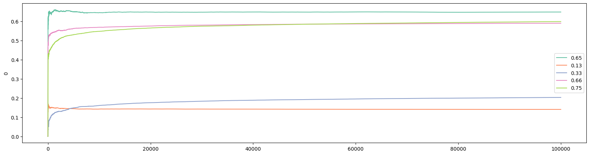

# Bayesian Approaches for Randomized Controlled Trials

## Introduction

Randomized Controlled Trial (RCT) is the gold standard for establishing causality in experimental methods such as clinical trials for new drugs or field experiments in social sciences and economics. In business especially e-commerce, RCT is known as A/B/N test. The main idea of RCT and A/B/N test is pretty straightforward: you have a group of individuals who are being divided randomly into groups to receive different treatments. Afterwards, the outcomes are being compared and evaluated to find out which treatment works better/best. In RCT, a control group, where individuals received a "placebo", is included. Note that placebo should be considered as a type of treatment too, and individuals who receive a placebo are not getting "nothing". A placebo is something that has no therapeutic effect, i.e., it is not designed to cure a disease or illness. But a placebo can positively impact the wellbeing of individuals who received it, if due to nothing but psychological effect. It would be rather wrong to expect "no effect" from the controlled group in RCT that receives the placebo.

For the rest of this article, I will be using A/B/N test as the example because I want to stay away from the nitty-gritty details of RCT. We will come back to RCT toward the end. I am using "A/B/N" to include tests for more than 2 versions. If you are only comparing two versions, it is an A/B test.

When I was interviewing for a data scientist job in 2022, the following was one of the interview questions: We are going to run an A/B test on a client's website. How to determine how long we need to run the experiment? Back then I knew about how to find minimum sample size based on hypothesis testing in statistics, so I framed my answer that way. But I stopped in the middle while answering the question because something I did not think about popped into my head: how would I know the standard deviation, one of the required values to carry out the calculation for sample size, before we even run the experiment? My interview went downhill from there. Needless to say, I did not get the job. However, the interviewer was nice enough to tell me that I should look at "power analysis".

I did. Suppose you own and built an e-commerce website with two different color pallettes, and you want to understand which color pallette would induce more purchases. You can randomly assign a visitor to the two versions of the website, and after a while, you will have a dataset with two columns: for each visitor, you recorded the version they saw and the purchases they have made. For $i\in(A,B)$, let's define the following values:
* $\bar{x}_i$: expected dollars spent by visitors of version $i$;
* $n_i$: number of visitors of version $i$;
* $s_i$: standard deviation of dollars spent by visitors of version $i$.

We can now calculate the "power" as
$$t=\frac{\bar{x}_A-\bar{x}_B}{s_p\sqrt{\tfrac{1}{n_A}+\tfrac{1}{n_B}}}$$
where $s_p=\sqrt{\frac{(n_A-1)s_A^2+(n_B-1)s_B^2}{n_A+n_B-2}}$ is the pooled standard deviation. The "power" $t$ follows a $t$-distribution with $n_A+n_B-2$ degrees of freedom.

Suppose you know that $s_A=s_B$ for the two versions in your A/B test, which we will denote as $s$. Also suppose, for simplicity, you want $n_A=n_B$. You can solve for $n_i$ and from the above power analysis formula and obtain:
$$N=\frac{4t^2s^2}{(\bar{x}_A-\bar{x}_B)^2}$$
where $N$ is the total sample size ($n_A+n_B$). It is easy to see that you will need a larger sample size if
* the expected difference between the two versions are smaller.
* you want a better significance level, e.g., 1% instead of 5%;
* the standard deviation is bigger, i.e., dollars spent are more dispersed among individuals;

But here is the problem: you do not know the values of $\bar{x}_i$ and $s_i$ before the experiment. For $\bar{x}_i$, it is less of an issue. Instead of the expected values, all you really need is the expected difference, which can be specified. For example, suppose your website is currently running Version A and you know $\bar{x}_A=50$. And all you care is that Version B can increase expected dollars spent to 65. In other words, $\bar{x}_B-\bar{x}_A=15$. Even with that, you still need to know the standard deviations. How? Some suggest that you can run a short trial to estimate the standard deviation. But then, isn't the A/B test a trial itself?

Here is another problem about classic A/B test design. After I became a data scientist, at another company, we actually tried to run an A/B test. The problem is that, according to the aforementioned power analysis, the experiment needed to be ran for at least 3 months, but we did not have that much time. After 1 month, our model (Version B) outperformed the existed model (Version A). Could we have declared our model is the better one? According to classic A/B test design, the answer is "No" because we should not be "peeking" since such significant difference can be a result of random factors.

Now think about clinical trial for a new drug, then this "no peeking" rule can raise serious concerns. If a drug has proved its effectiveness after the first 500 patients, yet the power analysis tells you that you need to test it on 50,000 patients, what would you do? Isn't it unethical to continue to give a placebo to individuals who may be benefited from the actual drug?

These two problems have bothered me for a while, until I learned about the Bayesian approaches for A/B/N testing. Here is how it works. Instead of having a predetermined sample size, the A/B test is deployed in real-time. Continued with our example of a website with two color pallettes, a visitor is randomly assigned to a version of the website on the first visit. In practice, it is a good idea to make sure each version gets some visitors initially, e.g., for the 50 visitors, each version is assigned with equal probability. But from there, the version that received higher purchase values should get more visitors. This does not mean the other version is abandoned. Here, we face the Explore-Exploit Tradeoff.

## The Explore-Exploit Tradeoff

In a nutshell, the explore-exploit tradeoff shows a paradox: in order to find the best version, you need to explore, which means that the outcome of exploration necessarily improves the longer you keep trying different versions. However, to maximize total payoff, you want to stick with the best version once you have found it, which is to exploit. And this means that the outcome of exploitation necessarily deteriorates the longer you keep trying different versions since there is one and only one best version.

How to handle the explore-exploit tradeoff constitutes the core differences among algorithms. Some algorithms, such as variants of the "greedy" family, really focuses on exploitation. The disadvantage is that such algorithm can easily "saddle" into the second-best version, as I will show later in the section when we discuss the `Epsilon Greedy` algorithm. Others, such as `Optimistic Initial Values`, focuses on exploration, at least initially.

If you are reading this article because you think it may help with your research project(s), you are not stranger to the explore-exploit tradeoff. I remember a conversation I had with a professor from graduate school not long after I graduated. I asked him if I should have given up on projects that I do not think that would end up in good journals. His answer was: but how do you know? He had a point: my professor never published any chapter of his PhD dissertation. He was successful only after he had explored a new area of research. However, about 15 years after he has graduated, a paper on a topic very closely related to the one he worked on in his dissertation was published in a top journal. In retrospect, he may have explored more than the optimum, which was probably why he suggested me to exploit more.

## Epsilon Greedy

We will begin our in-depth discuss of algorithms with `Epsilon Greedy`. For each algorithm, I aim to provide the following:
* theory and intuition
* pseudocode
* `Python` code

I learned about these algorithms from the Udemy course [Bayesian Machine Learning in Python: A/B Testing](https://www.udemy.com/course/bayesian-machine-learning-in-python-ab-testing/). Although `Python` scripts were provided in the course, the ones that I will show in this article were first built on my own, then updated based on those provided in the course for better efficiency and practicality.

Algorithms in the `greedy` family applies a simple logic: choose the version that gives the best *historical* expected payoff. For simplicity, let's consider an e-commerce website that has 5 different designs but sells a single product: an EveryDay-Carry (EDC) musical instrument for 69.99 dollars. If we run an A/B/N test on the designs, only 2 outcomes are possible from each visitor: buy or not buy.

While not necessary, we can try out all 5 algorithms in the beginning. For example, for the first 50 visitors, we send them to each design with equal probability. From that point on, the algorithm finds the version that gives the best expected payoff, and play that version. Here is the pseudocode:

```
for i in [1, 50]:
    choose each bandit randomly
while True:
    j = argmax(expected bandit payoffs)
    x = pay from playing bandit j
    bandit[j].update_mean(x)
```

I have used **bandit** instead of version because the problem we are working on is known as the ``Multi-Armed Bandits`` problem in probability theory and machine learning. The analogy stems from choosing from multiple slot machines in a casino since a slot machine is referred to as a "one-armed bandit".

Let's take a closer look at the pseudocode. In the pseudocode, $i$ indexes visitor, $j$ indexes the website version (or bandit), and $x$ is either 69.99, when the visitor buys, or 0. Furthermore, `update_mean()` is a function that takes the new value of `x` and update the expected payoff for bandit `j`. To update the expected payoff after bandit `j` was played for the $n_{th}$ time, we have
$$\bar{x}_n=\frac{\bar{x}_{n-1}*\times*(n-1)+x_n}{n}$$

This calculates the mean at constant time, i.e., it requires only 3 values to calculate the mean regardless of the value of $n$: $\bar{x}_{n-1}$, $x_n$, and $n$, whereas the number of values required to calculate the mean with the formula
$$\bar{x}_n=\frac{\sum_{i=1}^n{x_i}}{n}$$
increases with $n$.

It should be obvious that the above `greedy` algorithm has an obvious problem: once it finds a bandit with high enough payoff, it rarely switches. In other words, it almost never explores. `Epsilon Greedy` provides simple fix:
```
for i in [1, 50]:
    choose each bandit randomly
while True:
    p = random number in [0, 1]
    if p < epsilon:
        j = choose a bandit at random
    else:
        j = argmax(expected bandit payoffs)
    x = pay from playing bandit j
    bandit[j].update_mean(x)
```

As the pseudocode indicates, a random value is drawn when a new visitor has arrived. If the random value is smaller than the threshold `epsilon`, set before the start of the experiment, then a random bandit is picked. Note that this randomly picked bandit can be the same as the one otherwise picked by `argmax`. To exclude such case only requires a few more lines of code. However, there is no obvious reason to do so.

Let's now move onto the actual implementation in `Python`. Note that there are lines with comment "*only in demonstration*." These lines are for generating *true* probabilities of different bandits, which you obvious do not know when running a real-world experiment.

```python
import numpy as np
import random

# set the number of bandits
N_bandits = 5
# set the number of trials/visitors
# only in demonstration
N = 100000
# set the number of trials to try all bandits
N_start = 50

class BayesianAB:
  def __init__(
      self,
      number_of_bandits: int = 2,
  ):
    self.prob_true = [0] * number_of_bandits # only in demonstration
    self.prob_win = [0] * number_of_bandits
    self.history = []
    self.count = [0] * number_of_bandits

    # set the last bandit to have a win rate of 0.75 and the rest lower
    # only in demonstration
    self.prob_true[-1] = 0.75
    for i in range(0, number_of_bandits-1):
      self.prob_true[i] = round(0.75 - random.uniform(0.05, 0.65), 2)


  # Receives a random value of 0 or 1
  # only in demonstration
  def pull(
      self,
      i,
  ) -> bool:
    return random.random() < self.prob_true[i]

  # Updates the mean
  def update(
      self,
      i,
      k,
  ):
    outcome = self.pull(i)
    # may use a constant discount rate to discount past
    self.prob_win[i] = (self.prob_win[i] * k + outcome) / (k+1)
    self.history.append(self.prob_win.copy())
    self.count[i] += 1

  ####################
  # epsilon greedy
  def epsilon_greedy(
      self,
      epsilon: float, # decay epsilon?
  ) -> list:

    self.history.append(self.prob_win.copy())

    for k in range(0, N_start):
        i = random.randrange(0, len(self.prob_win))
        self.update(i, k)

    for k in range(N_start, N):
      # find index of the largest value in prob_win
      i = np.argmax(self.prob_win)

      if random.random() < epsilon:
        j = random.randrange(0, len(self.prob_win))
        # If the randomly picked bandit is the same as one from argmax, pick a different one
        while j == i:
          j = random.randrange(0, len(self.prob_win))
        else:
          i = j

      self.update(i, k)

    return self.history
```

Let's take a closer look at tht script. First, we import two libraries: `numpy` and `random`:
```python
import numpy as np
import random
```

We then set three global parameters:
```python
# set the number of bandits
N_bandits = 5
# set the number of trials/visitors
N = 100000
# set the number of trials to try all bandits
N_start = 50
```
In practice, the value of `N_bandits` would depend on the number of versions your experiment is set out to test, and the number of visitors, `N`, is not necessary.

In this script, we are creating a `class` named `BayesianAB`. Eventually, this class will include all the algorithms we cover in this article. We initiate the class with the following values:
```python
class BayesianAB:
  def __init__(
      self,
      number_of_bandits: int = 2,
  ):
    self.prob_true = [0] * number_of_bandits # only in demonstration
    self.prob_win = [0] * number_of_bandits
    self.history = []
    self.count = [0] * number_of_bandits
```
The `BayesianAB` class has a default of 2 bandits. We first pre-allocate four lists to store values needed for the algorithm:
* `prob_true`: stores the *true* probability of each bandit. These probabilities are to be generated next. In practice, you do not know these true probabilities;
* `prob_win`: stores the *empirical* probability of each bandit. Values in this list are to be updated during the experiment;
* `history`: stores the history of `prob_win` in each trial. This is important for both updating the mean at constant time (see above) and evaluation of bandit performance. We will plot the `history` later;
* `count`: stores the number of times each bandit was chosen;

The following lines generates the *true* probabilities:
```python
    # set the last bandit to have a win rate of 0.75 and the rest lower
    # only in demonstration
    self.prob_true[-1] = 0.75
    for i in range(0, number_of_bandits-1):
      self.prob_true[i] = round(0.75 - random.uniform(0.05, 0.65), 2)
```
The last bandit is given a win probability of .75, and rest of them somewhat random but lower than .75. An alternative method is to hardcode the probabilities. I used this approach to allow flexibility in specifying the number of bandits using `N_bandits` (or `number_of_bandits` inside the `BayesianAB` class).

Next, we define two functions commonly used by almost all algorithms:
```python
  # Receives a random value of 0 or 1
  # only in demonstration
  def pull(
      self,
      i,
  ) -> bool:
    return random.random() < self.prob_true[i]

  # Updates the mean
  def update(
      self,
      i,
      k,
  ):
    outcome = self.pull(i)
    # may use a constant discount rate to discount past
    self.prob_win[i] = (self.prob_win[i] * k + outcome) / (k+1)
    self.history.append(self.prob_win.copy())
    self.count[i] += 1
```
The first function returns either True or False depended on if the value of `random.random()` is less than the true probability of bandit $i$. This is unnecessary in practice. Instead, a call to either the `BayesianAB` class or specific method (such as `epsilon greedy`) inside `BayesianAB` should be triggered with a new visitor, and by the end of the visit, you would know if the visitor has purchased (True) or not (False). In `Python`, `True` is given a numerical value of 1 and `False` 0.

The `update` function updates the mean. It also adds the new empirical probabilities to the list `history` and increase the count of bandit $i$ being picked by 1.

Here is the actual method inside `BayesianAB` that implements `epsilon greedy`:
```python
  def epsilon_greedy(
      self,
      epsilon: float, # decay epsilon?
  ) -> list:

    self.history.append(self.prob_win.copy())

    for k in range(0, N_start):
        i = random.randrange(0, len(self.prob_win))
        self.update(i, k)

    for k in range(N_start, N):
      # find index of the largest value in prob_win
      i = np.argmax(self.prob_win)

      if random.random() < epsilon:
        j = random.randrange(0, len(self.prob_win))
        # If the randomly picked bandit is the same as one from argmax, pick a different one
        while j == i:
          j = random.randrange(0, len(self.prob_win))
        else:
          i = j

      self.update(i, k)

    return self.history
```

It essentially follows our pseudocode. In the first `for` loop, it assigns visitors randomly to the 5 bandits for the first 50 visitors (given by `N_start`). After each assignment, it calls the `update` function to update the mean. Starting with the 51st visitor, the second `for` loop is triggered and the following steps follow:
1. Find out which bandit ($i$) has the highest expected payoff;
2. Checks if a random value is smaller than `epsilon` (to be specified when the `epsilon_greedy` method is called). If this is `True`, then a random bandit ($j$) is selected;
3. If the randomly selected bandit is the same as the one with the highest expected payoff ($j=i$), then choose randomly choose another bandit, until the two are not the same;
4. Update the mean for the chosen bandit by calling the `update` function.

The `epsilon_greedy` method returns the complete history, which stores all information during the run as discussed earlier.

To call `epsilon_greedy` and examine the results, we execute the following:
```python
eg = BayesianAB(N_bandits)
print(f'The true win rates: {eg.prob_true}')
eg_history = eg.epsilon_greedy(epsilon=0.5)
print(f'The observed win rates: {eg.prob_win}')
print(f'Number of times each bandit was played: {eg.count}')
```
Here, we call `epsilon_greedy` and give a value of 0.5 as `epsilon`. We also print out the true probabilities, the empirical probabilities, and the number of times each bandit was played. Here is the output from a typical run:
```
The true win rates: [0.23, 0.51, 0.64, 0.54, 0.75]
The observed win rates: [0.1733, 0.4404, 0.6276, 0.4164, 0.5469]
Number of times each bandit was played: [12341, 12500, 49985, 12732, 12442]
```

In the above run, the best bandit was NOT the one that got chosen the most times. The second best bandit, with win probability of 0.64, was picked about half of the time, as dictated by the value of `epsilon`. This is due to the bandit with a 0.64 win rate did exceptional well among the first 50 visitors, and since it is close enough to the win rate of the best version, random jumps to the version with a 0.75 win rate were not enough to 'flip' the results.

Also note that the empirical probabilities are not guaranteed to converge to the true probabilities except for the 'chosen' one, in this case, the third bandit with a win rate of 64%.

We can also visualize the outcome with the following code:
```python
import pandas as pd
import matplotlib.pyplot as plt
import seaborn as sns

def plot_history(
    history: list,
    prob_true: list,
    k = N,
):

  df_history = pd.DataFrame(history[:k])
  plt.figure(figsize=(20,5))

  # Define the color palette
  colors = sns.color_palette("Set2", len(prob_true))

  for i in range(len(prob_true)):
    sns.lineplot(x=df_history.index, y=df_history[i], color=colors[i])
  
  # Create custom legend using prob_true and colors
  custom_legend = [plt.Line2D([], [], color=colors[i], label=prob_true[i]) for i in range(len(prob_true))]
  plt.legend(handles=custom_legend)
```
Then execute:
```python
plot_history(history=eg.history, prob_true=eg.prob_true)
```

Here is the output from the above run:



## Optimistic Initial Values


## References (Incomplete)

https://en.m.wikipedia.org/wiki/Multi-armed_bandit

https://www.tensorflow.org/agents/tutorials/intro_bandit

https://www.optimizely.com/optimization-glossary/multi-armed-bandit/