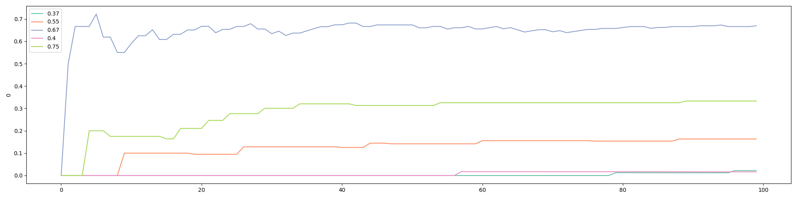

随机对照试验的贝叶斯方法（2）
=======================

**作者：** *罗子俊*

我们在上一篇文章“随机对照试验的贝叶斯方法（1）”当中讨论了Epsilon Greedy这个算法，并且给出了详尽的Python代码。现在，我们就来看看这个代码的细节。

首先，我们导入`numpy`和`random`这两个库。我们会用到`numpy`当中的`argmax`以及`random`当中的`randrange`：

```python
import numpy as np
import random
```

然后，我们设定三个全局参数：

```python
# set the number of bandits
N_bandits = 5
# set the number of trials/visitors
N = 100000
# set the number of trials to try all bandits
N_start = 50
```

在实际应用中，`N_bandits`的值将取决于你使用中所测试的版本数，而访客数`N`则是未知的。

在这个代码中，我们将会构造一个名为的`BayesianAB`的类（class）。这篇文章里的所有算法，都会放在这个类的下面。我们首先初始化以下数值：

```python
class BayesianAB:
  def __init__(
      self,
      number_of_bandits: int = 2,
  ):
    self.prob_true = [0] * number_of_bandits # only in demonstration
    self.prob_win = [0] * number_of_bandits
    self.history = []
    self.count = [0] * number_of_bandits
    self.a = [1] * number_of_bandits
    self.b = [1] * number_of_bandits
```

`BayesianAB` 默认有两个老虎机。我们预分配六个列表来储存算法所用到的值：
* `prob_true` 用来储存每个老虎机胜率的真实值。在实际应用当中，这些真实值是未知的；
* `prob_win` 用来储存每个老虎机胜率的计算值。这个值会在每一轮当中更新；
* `history` 用来储存每一轮所产生的 `prob_win` 值。这些值既可以用于计算下一轮的均值，也可以用来在最后评估算法的效果；
* `count` 用来储存每个老虎机所被使用的次数；
* `a` and `b` 是汤普森采样（`Thompson Sampling`）方法所需要用到的数值。这个算法会在后面讨论。

下面几行代码构建老虎机胜率的真实值：

```python
    # set the last bandit to have a win rate of 0.75 and the rest lower
    # only in demonstration
    self.prob_true[-1] = 0.75
    for i in range(0, number_of_bandits-1):
      self.prob_true[i] = round(0.75 - random.uniform(0.05, 0.65), 2)
```

其中，最后一个老虎机有最高的胜率，在这里设置为.75。剩下的老虎机胜率在.1和.7之间。我们也可以直接指定几个胜率，但是我更喜欢我在这里用的方法，因为这样我就可以允许胜率值的数量随着`N_bandits`的值而改变。

接下来，我们定义两个函数。文章里的好几个算法都会用到这两个函数：

```python
  # Returns a random value of 0 or 1
  # only in demonstration
  def pull(
      self,
      i,
  ) -> bool:
    return random.random() < self.prob_true[i]

  # Updates the mean
  def update(
      self,
      i,
      k,
  ):
    outcome = self.pull(i)
    # may use a constant discount rate to discount past
    self.prob_win[i] = (self.prob_win[i] * k + outcome) / (k+1)
    self.history.append(self.prob_win.copy())
    self.count[i] += 1
```

`pull()`函数会比较`random.random()`所产生的随机数以及老虎机$i$的胜率。如果随机数小于胜率，那么就返回1，反之，则返回0。这个函数在实际应用当中是多余的。在实际应用中，每当网站有一个新的访客时，系统就会触发`BayesianAB`或者这个类里面的某一个方法。在这个访客离开网站前，你就会知道他/她有没有买东西。如果买了，就是1，没有买，就是0。

`update()`函数会更新预期值，并且把一些其他数值储存到`history`当中去。最后，它还会给老虎机$i$的计数器加1。

下面是`BayesianAB`中真正执行`贪婪算法`的代码：

```python
  def epsilon_greedy(
      self,
      epsilon: float, # decay epsilon?
  ) -> list:

    self.history.append(self.prob_win.copy())

    for k in range(0, N_start):
        i = random.randrange(0, len(self.prob_win))
        self.update(i, k)

    for k in range(N_start, N):
      # find index of the largest value in prob_win
      i = np.argmax(self.prob_win)

      if random.random() < epsilon:
        j = random.randrange(0, len(self.prob_win))
        # If the randomly picked bandit is the same as one from argmax, pick a different one
        while j == i:
          j = random.randrange(0, len(self.prob_win))
        else:
          i = j

      self.update(i, k)

    return self.history
```

上面的代码与伪代码的逻辑基本一致。首先，在第一个迭代循环中，头50个（`N_start`）访客会被随机分配到5个不同的版本。借着，`update()`函数会根据随机结果更新版本 $i$ 的均值。从第51个访客开始，第二个迭代循环将会被执行。这个循环会执行以下步骤：
1. 找到预期回报率最高的版本 $i$；
2. 检查从`random.random()`中得到的随机值是否小于`epsilon`。如果随机值小于`epsilon`，那么将随机选取一个版本 $j$；`epsilon`的值将在代码运行的时候被指定；
3. 如果随机选选取的版本 $j$ 与预期回报率最高的版本 $i$ 是同一个版本，那么就随机再选取另外一个版本，直到 $j$ 与 $i$ 不相等为止；
4. 通过`update()`函数来更新被选中版本的均值。

`epsilon_greedy()`会返回实验的完整历史，其中包括每个版本被选中的次数以及它们的预期值。

我们可以通过下面的代码来执行`epsilon_greedy()`。我们还会打印一些基本的结果：

```python
eg = BayesianAB(N_bandits)
print(f'The true win rates: {eg.prob_true}')
eg_history = eg.epsilon_greedy(epsilon=0.5)
print(f'The observed win rates: {eg.prob_win}')
print(f'Number of times each bandit was played: {eg.count}')
```

我们在执行`epsilon_greedy()`的时候指定了`epsilon`为0.5。这意味着在算法执行的时候，有一般的时间会探索。当实验结束后，我们打印出胜率的真实值，胜率的预期值，以及每个版本被选中的次数。下面是其中一次实验的结果：

```
The true win rates: [0.65, 0.13, 0.33, 0.66, 0.75]
The observed win rates: [0.6487, 0.1411, 0.2035, 0.5903, 0.5989]
Number of times each bandit was played: [50141, 12596, 12385, 12443, 12435]
```

在这个实验中，胜率最高（0.75）的版本并不是被选中次数最多的。有大概一半的访客被选定了一个胜率只有0.65的次优版本。这是因为这个次优的版本在最开始的50个访客中表现得特别好。因为0.65和0.75的差别也不是特别大，当算法随机选取到最优版本的时候，也没有足以让最优版本超过次优版本。

值得注意的是，除了被选择最多的版本，这个实验中所观察到的胜率的预期值并没有收敛到真实值。这是因为这个实验只有10万个访客。如果访客的数量趋于无穷大，那么每个版本所被选中的次数也会趋于无穷大，那么所有版本的胜率都将收敛到真实值。这也就意味着，如果实验进行的时间够长，最优版本最终肯定会超过次优版本。

接下来，我们用以下的代码来可视化结果：

```python
import pandas as pd
import matplotlib.pyplot as plt
import seaborn as sns

def plot_history(
    history: list,
    prob_true: list,
    k = N,
):

  df_history = pd.DataFrame(history[:k])
  plt.figure(figsize=(20,5))

  # Define the color palette
  colors = sns.color_palette("Set2", len(prob_true))

  for i in range(len(prob_true)):
    sns.lineplot(x=df_history.index, y=df_history[i], color=colors[i])
  
  # Create custom legend using prob_true and colors
  custom_legend = [plt.Line2D([], [], color=colors[i], label=prob_true[i]) for i in range(len(prob_true))]
  plt.legend(handles=custom_legend)
```

执行以下命令，将会得到线状图：

```python
plot_history(history=eg.history, prob_true=eg.prob_true)
```


我们也可以通过以下的命令来看看头100个访客的情况：

```python
plot_history(history=eg.history, prob_true=eg.prob_true, k=100)
```



## 乐观初始值（Optimistic Initial Values）

“乐观初始值”算法是这篇文章所讨论的算法中我最喜欢的之一（另一个是“梯度强盗（Gradient Bandits）”）。上一节当中贪婪算法（Epsilon Greedy）侧重于“开发”，但“乐观初始值”算法则在最初更注重“探索”。在最初的探索之后，它就会开始“贪婪”，并选择胜率预期值最高的策略。算法的名称已经清楚地告诉了你它的工作原理：在实验开始时，每个版本都被设置为具有很高的期望收益。换句话说，我们对每个版本都持“乐观”态度。这确保了每个版本在实验开始的时候都会被选中好几次。因此，这个算法不需要留出50个访客来“试水”。如果我们将“贪心算法”比作价值随时间而上升的英式拍卖，那么“乐观初始值”就像价值随时间下降的荷兰拍卖。以下是伪代码：

```
p_init = 5 # a large value as initial win rate for ALL bandits

loop:
    j = argmax(expected bandit win rates)
    x = Reward (1 or 0) from playing bandit j
    bandit[j].update_mane(x)
```

如果你已经有了前一节的代码，你可以在`BayesianAB`类中增加一下代码来执行乐观初始值算法：

```python
  ####################
  # optimistic initial values
  def optim_init_val(
      self,
      init_val: float,
  ) -> list:

    self.prob_win = [init_val] * len(self.prob_win)
    self.history.append(self.prob_win.copy())

    for k in range(1, N):
      # find index of the largest value in prob_win
      i = np.argmax(self.prob_win)

      self.update(i, k)

    return self.history
```

乐观初始值算法比贪婪算法的代码要更简洁一下。二者最大的区别是在最初把`init_val`指定为`prob_win`的初始值。我们可以执行以下代码来运行乐观初始值算法的实验，并且得到实验的可视化结果：

```python
oiv = BayesianAB(N_bandits)
print(f'The true win rates: {oiv.prob_true}')
oiv_history = oiv.optim_init_val(init_val=0.99)
print(f'The observed win rates: {oiv.prob_win}')
print(f'Number of times each bandit was played: {oiv.count}')

# plot the entire experiment history
plot_history(history=oiv.history, prob_true=oiv.prob_true)
```

执行以上代码的结果如下：

```
The true win rates: [0.6, 0.54, 0.62, 0.14, 0.75]
The observed win rates: [0.6633, 0.7493, 0.7491, 0.7493, 0.7521]
Number of times each bandit was played: [2, 168, 285, 65, 99479]
```


如果我们只看头100个访客，结果则是这样的：


可以看出来，胜率最高的版本很早就被算法所发现了。

在执行乐观初始值算法时，我将`init_val`设置为0.99，因为胜率不会超过1。初始值越大，算法最初的探索就越多。因为初始乐观值的设计就是在实验开始时进行探索，所以与其他算法（如Epsilon Greedy）相比，它可能需要更长的时间来发现最佳版本。值得注意的是，除了被选中的那个版本，乐观初始值算法所得到的胜率预期值不会收敛到真实值。这是本文讨论的好几种算法的一个共同特点。

在下一篇文章，我们会讨论置信上限（Upper Confidence Bound）算法。