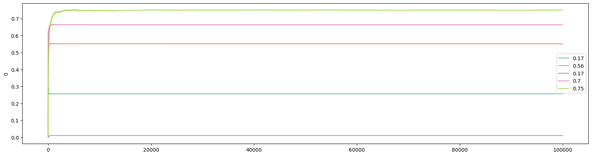

Bayesian Approaches for Randomized Controlled Trials
====================================================

**Author:** *Zijun Luo*

## Introduction

Randomized Controlled Trial (RCT) is the gold standard for establishing causality in experimental methods such as clinical trials for new drugs or field experiments in social sciences and economics. In business, especially e-commerce, RCT is known as A/B/N test. The main idea of RCT and A/B/N test is straightforward: individuals are randomly divided into groups to receive different treatments. Afterwards, the outcomes are being valuated and compared in order to find out which treatment works better/best. In RCT, a control group, where individuals receive a "placebo", is included. Note that placebo should be considered as a type of treatment too and individuals who receive a placebo are not getting "nothing". A placebo is something that has no therapeutic effect, i.e., it is not designed to cure a disease or an illness. But a placebo can positively impact the well-being of individuals who received it, if due to nothing but psychological effects. As a result, it would be rather wrong to expect "no effect" from the the controlled group that receives the placebo in an RCT.

In the rest of this article, I will be using A/B/N test as the example because I want to stay away from the nitty-gritty details of RCT. We will come back to RCT toward the end. I am using "A/B/N" to include tests with more than 2 versions. If you are only comparing two versions, it is an A/B test.

When I was interviewing for a data scientist job in 2022, the following was one of the interview questions: We are going to run an A/B test on a client's website. How long do we need to run the experiment for? Back then I knew about how to find minimum sample size based on hypothesis testing in Statistics, so I framed my answer that way. But I stopped in the middle while answering the question. Something I did not think seriously enough about popped into my head: how would I know the standard deviation, one of the required values to carry out the calculation for sample size, before we even run the experiment? My interview went downhill from there. Needless to say, I did not get the job. However, the interviewer was nice enough to tell me that I should look into "power analysis".

I did. Suppose you have built an e-commerce website with two possible color pallettes, and you want to understand which color pallette would induce more purchases. You can randomly assign a visitor to the two versions of the website, and after a while, you will have a dataset with two columns: for each visitor, you recorded the version that the visitor was assigned to and the purchases that the visitor made. For $i\in(A,B)$, let's define the following values:
* $\bar{x}_i$: expected dollars spent by visitors of version $i$;
* $n_i$: number of visitors of version $i$;
* $s_i$: standard deviation of dollars spent by visitors of version $i$.

We can now calculate the "power" as
$$t=\frac{\bar{x}_A-\bar{x}_B}{s_p\sqrt{\tfrac{1}{n_A}+\tfrac{1}{n_B}}}$$
where $s_p=\sqrt{\frac{(n_A-1)s_A^2+(n_B-1)s_B^2}{n_A+n_B-2}}$ is the pooled standard deviation. The "power", $t$, follows a $t$-distribution with $n_A+n_B-2$ degrees of freedom.

Suppose you know that $s_A=s_B$ for the two versions in your A/B test, which we will denote as $s$. Also suppose, for simplicity, you want $n_A=n_B$. You can solve for $n_i$ from the above power analysis formula and obtain:
$$N=\frac{4t^2s^2}{(\bar{x}_A-\bar{x}_B)^2}$$
where $N$ is the total sample size ($n_A+n_B$). It is easy to see that you will need a larger sample size if
* the expected difference between the two versions are smaller;
* you want a better significance level, e.g., 1% instead of 5%;
* the standard deviation is bigger, i.e., dollars spent are more dispersed among individuals;

But here is the problem: you do not know the values of $\bar{x}_i$ and $s_i$ before the experiment. For $\bar{x}_i$, it is less of an issue. Instead of the expected values, all you really need is the expected difference, which can be specified. For example, suppose your website is currently running Version A and you know $\bar{x}_A=50$. And all you care about is that Version B can increase expected dollars spent to 65. In other words, $\bar{x}_B-\bar{x}_A=15$. Even with that, you still need to know the standard deviations. How? Some suggest that you can run a short trial to estimate the standard deviation. But then, isn't the A/B test a trial itself?

Here is another problem about classic A/B test design. After I became a data scientist, at another company, we actually ran an A/B test. The problem is that, according to the aforementioned power analysis, the experiment needed to be ran for at least 3 months, but we did not have that much time. After 1 month, our model (Version B) outperformed the existed model (Version A). Could we have declared our model to be the better one? According to classic A/B test design, the answer is "No" because we should not be "peeking" since such significant difference can be a result of random factors.

Now think about clinical trials for a new drug, where the "no peeking" rule can raise serious concerns. If a drug has proved its effectiveness in the first 500 patients, yet the power analysis tells you that you need to test it on 50,000 patients, what would you do? Isn't it unethical to continue to give a placebo to individuals who may be benefited from the actual drug?

These two problems have bothered me for a while, until I learned about the Bayesian approaches for A/B/N testing. Here is how it works. Instead of having a predetermined sample size, the A/B test is deployed in real-time. Continued with our example of a website with two color pallettes, a visitor is randomly assigned to a version of the website on the first visit. In practice, it is a good idea to make sure each version gets some visitors initially, e.g., for the 50 visitors, each version is assigned with equal probability. But from there, the version that received higher purchase values should get more visitors. This does not mean that the other version is abandoned. Here, we face the Explore-Exploit Tradeoff.

## The Explore-Exploit Tradeoff

In a nutshell, the explore-exploit tradeoff shows the following paradox: in order to find the best version, you need to explore, which means that the outcome of exploration necessarily improves the longer you keep trying different versions. However, to maximize total payoff, you want to stick with the best version once (you think) you have found it, which is to exploit. And this means that the outcome of exploitation necessarily deteriorates the longer you keep trying different versions since there is one and only one best version.

How to handle the explore-exploit tradeoff constitutes the core differences among algorithms. Some algorithms, such as variants of the "greedy" family, really focuses on exploitation. The disadvantage is that such algorithm can easily "saddle" into the second-best as long as the second-best is "good enough", as I will show later in the section when we discuss the `Epsilon Greedy` algorithm. Others, such as `Optimistic Initial Values`, put more emphasis on exploration, at least initially.

If you are reading this article because you think it may help you with your research project(s), you are not a stranger to the explore-exploit tradeoff. I remember a conversation I had with a professor from graduate school not long after I graduated. I asked him if I should have given up on projects that I do not think that would end up in good journals. His answer was: but how do you know? He had a point: my professor never published any chapter from his PhD dissertation. He was successful only after he has explored a new area of research. However, about 15 years after his graduation, a paper on a topic very closely related to the one he worked on in his dissertation was published in a top journal. In retrospect, he may have explored more than the optimum, which was probably why he suggested me to exploit more.

## Epsilon Greedy

We will begin our in-depth discussion of algorithms with `Epsilon Greedy`. For each algorithm, I aim to provide the following:
* theory and intuition
* pseudocode
* `Python` code

<!--
I learned about these algorithms from the Udemy course [Bayesian Machine Learning in Python: A/B Testing](https://www.udemy.com/course/bayesian-machine-learning-in-python-ab-testing/). Although `Python` scripts were provided in the course, the ones that I will show in this article were first built on my own, then updated based on those provided in the course for better efficiency and practicality.
-->

Algorithms in the `Greedy` family applies a simple logic: choose the version that gives the best *observed* expected payoff. For simplicity, let's consider an e-commerce website that has 5 different designs but sells a single product: an EveryDay-Carry (EDC) musical instrument for 69.99 dollars. If we run an A/B/N test on the designs, only 2 outcomes are possible from each visitor: buy or not buy.

While not necessary, we can try out all 5 algorithms in the beginning. For example, for the first 50 visitors, we send them to each design with equal probability. From that point on, the algorithm finds the version that gives the best expected payoff, and play that version. Here is the pseudocode for a simple `Greedy` algorithm:

```
for i in [1, 50]:
    choose each bandit randomly
loop:
    j = argmax(expected bandit win rates)
    x = reward (1 or 0) from playing bandit j
    bandit[j].update_mean(x)
```

I used **bandit** instead of **version** here, and will be using these two terms interchangeably, because the problem we are working on is commonly known as the ``Multi-Armed Bandits`` problem in probability theory and machine learning. The analogy stems from choosing from multiple slot machines in a casino since a single slot machine is referred to as a "one-armed bandit".

Let's take a closer look at the pseudocode. In the pseudocode, $i$ indexes visitor, $j$ indexes the website version (or bandit), and $x$ is 1 when the visitor buys and 0 otherwise. Furthermore, `update_mean()` is a function that takes the new value of `x` and updates the expected payoff for bandit `j`. To update the expected payoff after bandit `j` was played for the $n_{th}$ time, we have
$$\bar{x}_n=\bar{x}_{n-1}+\frac{x_n-\bar{x}_{n-1}}{n}$$

This calculates the mean in *constant time and memory*, i.e., it requires only 3 values to calculate the mean, $\bar{x}_n$, regardless of the value of $n$: $\bar{x}_{n-1}$, $x_n$, and $n$, whereas the number of values required to calculate the mean with the formula
$$\bar{x}_n=\frac{\sum_{i=1}^n{x_i}}{n}$$
increases with $n$.

It should be obvious that the above `Greedy` algorithm has a problem: once it finds a bandit with a *high enough* payoff, it rarely switches. In other words, it almost never explores. `Epsilon Greedy` provides a simple fix:

```
for i in [1, 50]:
    choose each bandit randomly
loop:
    p = random number in [0, 1]
    if p < epsilon:
        j = choose a bandit at random
    else:
        j = argmax(expected bandit win rates)
    x = reward (1 or 0) from playing bandit j
    bandit[j].update_mean(x)
```

As the pseudocode shows, a random value is drawn when a new visitor has arrived. If the random value is smaller than the threshold `epsilon`, set before the start of the experiment, then a random bandit is picked. Note that this randomly picked bandit can be the same as the one picked by `argmax`. To exclude such case only requires a few more lines of code. However, the benefit of doing so is not obvious.

Let's now move onto the actual implementation of `Epsilon Greedy` in `Python`. Note that the script includes lines with the comment "*only in demonstration*". These are codes to generate the *true* probabilities of different bandits, which you obviously do not know when running a real-world experiment.

```python
import numpy as np
import random

# set the number of bandits
N_bandits = 5
# set the number of trials/visitors
# only in demonstration
N = 100000
# set the number of trials to try all bandits
N_start = 50

class BayesianAB:
  def __init__(
      self,
      number_of_bandits: int = 2,
  ):
    self.prob_true = [0] * number_of_bandits # only in demonstration
    self.prob_win = [0] * number_of_bandits
    self.history = []
    self.count = [0] * number_of_bandits
    self.a = [1] * number_of_bandits
    self.b = [1] * number_of_bandits

    # set the last bandit to have a win rate of 0.75 and the rest lower
    # only in demonstration
    self.prob_true[-1] = 0.75
    for i in range(0, number_of_bandits-1):
      self.prob_true[i] = round(0.75 - random.uniform(0.05, 0.65), 2)

  # Receives a random value of 0 or 1
  # only in demonstration
  def pull(
      self,
      i,
  ) -> bool:
    return random.random() < self.prob_true[i]

  # Updates the mean
  def update(
      self,
      i,
      k,
  ):
    outcome = self.pull(i)
    # may use a constant discount rate to discount past
    self.prob_win[i] = (self.prob_win[i] * k + outcome) / (k+1)
    self.history.append(self.prob_win.copy())
    self.count[i] += 1

  ####################
  # epsilon greedy
  def epsilon_greedy(
      self,
      epsilon: float, # decay epsilon?
  ) -> list:

    self.history.append(self.prob_win.copy())

    for k in range(0, N_start):
        i = random.randrange(0, len(self.prob_win))
        self.update(i, k)

    for k in range(N_start, N):
      # find index of the largest value in prob_win
      i = np.argmax(self.prob_win)

      if random.random() < epsilon:
        j = random.randrange(0, len(self.prob_win))
        # If the randomly picked bandit is the same as one from argmax, pick a different one
        while j == i:
          j = random.randrange(0, len(self.prob_win))
        else:
          i = j

      self.update(i, k)

    return self.history
```

Let's break it down. First, we import two libraries: `numpy` and `random`. We will be using functions from these libraries such as `argmax` from `numpy` and `randrange` from `random`:

```python
import numpy as np
import random
```

We then set three global parameters:

```python
# set the number of bandits
N_bandits = 5
# set the number of trials/visitors
N = 100000
# set the number of trials to try all bandits
N_start = 50
```

In practice, the value of `N_bandits` would depend on the number of versions your experiment is set out to test, and the number of visitors, `N`, is unknown.

In this script, we are creating a class named `BayesianAB`. Eventually, this class will include all the algorithms we cover in this article. We initiate the class with the following values:

```python
class BayesianAB:
  def __init__(
      self,
      number_of_bandits: int = 2,
  ):
    self.prob_true = [0] * number_of_bandits # only in demonstration
    self.prob_win = [0] * number_of_bandits
    self.history = []
    self.count = [0] * number_of_bandits
    self.a = [1] * number_of_bandits
    self.b = [1] * number_of_bandits
```

The `BayesianAB` class has a default of 2 bandits. We first pre-allocate 6 lists to store several values:
* `prob_true` stores the *true* probability of each bandit. These probabilities are to be generated next. In practice, you do not know these true probabilities;
* `prob_win` stores the *observed* probability of each bandit. Values in this list are to be updated during each round of the experiment;
* `history` stores the history of `prob_win` in each trial. This is important for both updating the mean in constant time (see above) and the evaluation of bandit performance afterwards;
* `count` stores the number of times each bandit was chosen;
* `a` and `b` are values used in `Thompson Sampling` or `Bayesian Bandit`, the last algorithm to be considered in this article.

The following lines generates the *true* probabilities:

```python
    # set the last bandit to have a win rate of 0.75 and the rest lower
    # only in demonstration
    self.prob_true[-1] = 0.75
    for i in range(0, number_of_bandits-1):
      self.prob_true[i] = round(0.75 - random.uniform(0.05, 0.65), 2)
```

The last bandit has the highest win rate, which is .75, and the rest of them are randomized between .1 and .7. An alternative method is to hardcode the probabilities. I used the randomized approach to allow for flexibility in specifying the number of bandits using `N_bandits` (or `number_of_bandits` inside the `BayesianAB` class).

Next, we define two functions used by several algorithms:

```python
  # Returns a random value of 0 or 1
  # only in demonstration
  def pull(
      self,
      i,
  ) -> bool:
    return random.random() < self.prob_true[i]

  # Updates the mean
  def update(
      self,
      i,
      k,
  ):
    outcome = self.pull(i)
    # may use a constant discount rate to discount past
    self.prob_win[i] = (self.prob_win[i] * k + outcome) / (k+1)
    self.history.append(self.prob_win.copy())
    self.count[i] += 1
```

The first function, `pull()`, returns either True or False depending on if the value of `random.random()` is less than the true probability of bandit $i$. This is unnecessary in practice. Instead, a call to either the `BayesianAB` class or a specific method (such as `Epsilon Greedy`) inside `BayesianAB` should be triggered with the arrival of a new visitor, and by the end of the visit, you would know if the visitor has purchased (True) or not (False). In `Python`, `True` is given a numerical value of 1 and `False` a value of 0.

The `update()` function updates the mean. It also adds the updated observed probabilities to the list `history` and increase the count of bandit $i$ being picked by 1.

Here is the actual method inside `BayesianAB` that implements `epsilon greedy`:

```python
  def epsilon_greedy(
      self,
      epsilon: float, # decay epsilon?
  ) -> list:

    self.history.append(self.prob_win.copy())

    for k in range(0, N_start):
        i = random.randrange(0, len(self.prob_win))
        self.update(i, k)

    for k in range(N_start, N):
      # find index of the largest value in prob_win
      i = np.argmax(self.prob_win)

      if random.random() < epsilon:
        j = random.randrange(0, len(self.prob_win))
        # If the randomly picked bandit is the same as one from argmax, pick a different one
        while j == i:
          j = random.randrange(0, len(self.prob_win))
        else:
          i = j

      self.update(i, k)

    return self.history
```

It basically follows the pseudocode. The first `for` loop assigns visitors randomly to the 5 bandits for the first 50 visitors (given by `N_start`). After each assignment, it calls the `update()` function to update the mean. Starting with the 51st visitor (`Python` starts counting at 0), the second `for` loop is triggered and the following steps are followed:
1. Find out which bandit ($i$) has the highest expected payoff;
2. Checks if a random value is smaller than `epsilon` (to be specified when the `epsilon_greedy()` method is called). If this is `True`, then a random bandit ($j$) is selected;
3. If the randomly selected bandit is the same as the one with the highest expected payoff (i.e., $j=i$), then randomly choose another bandit, until the two are not the same;
4. Update the mean for the chosen bandit by calling the `update()` function.

The `epsilon_greedy()` method returns the complete history, which stores all information during the run as discussed earlier.

To call `epsilon_greedy()` and examine the results, we execute the following:

```python
eg = BayesianAB(N_bandits)
print(f'The true win rates: {eg.prob_true}')
eg_history = eg.epsilon_greedy(epsilon=0.5)
print(f'The observed win rates: {eg.prob_win}')
print(f'Number of times each bandit was played: {eg.count}')
```

Here, we call `epsilon_greedy()` and give a value of 0.5 to `epsilon`. This means the algorithm will explore half of the time. We also print out the true probabilities, the observed probabilities, and the number of times that each bandit was played. Here is the printed output from a typical run:

```
The true win rates: [0.65, 0.13, 0.33, 0.66, 0.75]
The observed win rates: [0.6487, 0.1411, 0.2035, 0.5903, 0.5989]
Number of times each bandit was played: [50141, 12596, 12385, 12443, 12435]
```

In the above run, the best bandit was NOT the one that got chosen the most. The second best bandit, with a 0.65 win rate, was picked about half of the time, as dictated by the value of `epsilon`. This is due to the bandit with a 0.65 win rate did exceptional well among the first 50 visitors. Since it is close enough to the win rate of the best version, random jumps to the version with a 0.75 win rate were not enough to "flip" the results.

Also note that the observed probabilities have not converged to the true probabilities except for the "chosen" one after 100,000 visitors. However, if the number of visitors approaches infinity, which means the number of times that each version was picked also approaches infinity, all win rates will converge to their true values. This means that the best version would eventually overtake the second-best if the experiment runs *long enough*.

We can visualize the outcome with the following code:

```python
import pandas as pd
import matplotlib.pyplot as plt
import seaborn as sns

def plot_history(
    history: list,
    prob_true: list,
    k = N,
):

  df_history = pd.DataFrame(history[:k])
  plt.figure(figsize=(20,5))

  # Define the color palette
  colors = sns.color_palette("Set2", len(prob_true))

  for i in range(len(prob_true)):
    sns.lineplot(x=df_history.index, y=df_history[i], color=colors[i])
  
  # Create custom legend using prob_true and colors
  custom_legend = [plt.Line2D([], [], color=colors[i], label=prob_true[i]) for i in range(len(prob_true))]
  plt.legend(handles=custom_legend)
```

Then execute:

```python
plot_history(history=eg.history, prob_true=eg.prob_true)
```

Here is the output from the above run:


We can also get the visualization for the first 100 visitors, which shows that the third bandit, the 0.65 win rate, jumped ahead early:

```python
plot_history(history=eg.history, prob_true=eg.prob_true, k=100)
```


## Optimistic Initial Values

The `Initial Optimistic Values` is one of my favorites (the other being `Gradient Bandit`) amongst the algorithms discussed in this article. While `Epsilon Greedy` focused on "exploit" and can end up choosing the second-best version, `Optimistic Initial Value` puts more focus on "explore" initially, while staying `greedy`, i.e., pick the strategy that shows the highest observed expected value. The name of this algorithm informs you about what it does: at the start of the experiment, each version is set to have a high expected payoff, i.e., being "optimistic" about each version. This ensures that each of them is played a fair number of times initially. As a result, there is no need to set aside 50 visitors to "test the water" in the beginning. If we compare `Epsilon Greedy` to English auction where the values go up over time, `Optimistic Initial Value` is like Dutch auction where the values go *down* over time. Here is the pseudocode:

```
p_init = 5 # a large value as initial win rate for ALL bandits

loop:
    j = argmax(expected bandit win rates)
    x = reward (1 or 0) from playing bandit j
    bandit[j].update_mane(x)
```

Assuming you already have the code from the `Epsilon Greedy` section, simply adding the following method inside the `BayesianAB` class will include `Optimistic Initial Value`:

```python
  ####################
  # optimistic initial values
  def optim_init_val(
      self,
      init_val: float,
  ) -> list:

    self.prob_win = [init_val] * len(self.prob_win)
    self.history.append(self.prob_win.copy())

    for k in range(1, N):
      # find index of the largest value in prob_win
      i = np.argmax(self.prob_win)

      self.update(i, k)

    return self.history
```

The only thing new here is the line that assigns `init_val` to `prob_win` at the start. We can execute the following to get results and visualization:

```python
oiv = BayesianAB(N_bandits)
print(f'The true win rates: {oiv.prob_true}')
oiv_history = oiv.optim_init_val(init_val=0.99)
print(f'The observed win rates: {oiv.prob_win}')
print(f'Number of times each bandit was played: {oiv.count}')

# plot the entire experiment history
plot_history(history=oiv.history, prob_true=oiv.prob_true)
```

And following are outcomes from a typical run:

```
The true win rates: [0.6, 0.54, 0.62, 0.14, 0.75]
The observed win rates: [0.6633, 0.7493, 0.7491, 0.7493, 0.7521]
Number of times each bandit was played: [2, 168, 285, 65, 99479]
```


From the visualization below, you can see that the best bandit jumped ahead even after just 100 visitors:


Note that I set `init_val` to 0.99 since we are comparing win rates that can not exceed 1. The larger the initial value, the more the algorithm explores initially. Because `Initial Optimistic Values` was specifically designed to explore in the beginning, it can "fall behind" in reaching the best version, if ever, compared to other algorithms such as `Epsilon Greedy`. Note that the observed probabilities do not converge to the true probabilities in `Initial Optimistic Values` except for the "chosen" one. This is a common feature of several algorithms discussed in this article.

## Upper Confidence Bound (UCB)

The theory of `UCB` is harder to fully grasp although its intuition and implementation are straightforward. To start, let's look back to the last two algorithms that we have discussed: `Epsilon Greedy` and `Optimistic Initial Values`. A common step in the implementation of both of these algorithms is to find the version that gives the best *observed* expected win rate. This is why both algorithms are said to be `greedy`. But can we do better, especially for the fact that we know these expected win rates are probabilistic. Put differently, we know that the more a certain version was chosen, the closer its expected win rate is to its true win rate. But what about those that were rarely picked?

That is where `Upper Confidence Bound` comes into play. The idea is that we should not be relying on the observed expected value alone. We should give each version some "bonus points": if a version has been chosen a lot, the bonus is small; but if a version has been barely chosen, it should get a larger bonus because, probabilistically, the observed expected value *can* be far from the true value if a version has not been picked much.

If you are interested in the math, you can read the paper "[Finite-time Analysis of the Multiarmed Bandit Problem](https://homes.di.unimi.it/~cesabian/Pubblicazioni/ml-02.pdf)". In the paper, the authors have outlined a function for the "bonus", which is commonly known as `UCB1`:
$$b_j=\sqrt{\frac{2\log{N}}{n_j}}$$
where $N$ is the total number of visitors at the time of computing the bonus, and $n_j$ is the number of times that bandit $j$ was chosen at the time of computing the bonus. Adding $b$ to the expected win rate gives the **upper confidence bound**:
$$\text{UCB1}_j=\bar{x}_{n_j}+b_j$$

Here is the pseudocode for `UCB1`:

```
loop:
    Update UCB1 values
    j = argmax(UCB1 values)
    x = reward (1 or 0) from playing bandit j
    bandit[j].update_mean(x)
```

Adding the following method into `BayesianAB` will implement `UCB1`:

```python
  ####################
  # upper confidence bound (UCB1)
  def ucb1(
      self,
  ) -> list:

    self.history.append(self.prob_win.copy())
    bandit_count = [0.0001] * len(self.prob_win)
    # bound = [0] * len(self.prob_win)

    for k in range(1, N):
      bound = self.prob_win + np.sqrt(2 * np.log(k) / bandit_count)
      # find index of the largest value in bound
      i = np.argmax(bound)

      self.update(i, k)

      if bandit_count[i] < 1:
        bandit_count[i] = 0
      bandit_count[i] += 1

    return self.history
```

This is very similar to what we had before. One thing to note is that I give a very small initial value ($0.0001$) to `bandit_count` to avoid the division of zero. Later, I reversed the value to 0 with the `if` statement. An alternative approach is that similar to what we did in `Epsilon Greedy`: run the first 50 iterations on all versions before implementing `UCB1` from the 51st onward.

Executing the following will give us results and visualizations for `UCB1`:

```python
ucb = BayesianAB(N_bandits)
print(f'The true win rates: {ucb.prob_true}')
ucb_history = ucb.ucb1()
print(f'The observed win rates: {ucb.prob_win}')
print(f'Number of times each bandit was played: {ucb.count}')

# plot the entire experiment history
plot_history(history=ucb.history, prob_true=ucb.prob_true)
```

A typical run gives the following:

```
The true win rates: [0.65, 0.12, 0.63, 0.33, 0.75]
The observed win rates: [0.6505, 0.1165, 0.1928, 0.0774, 0.3794]
Number of times each bandit was played: [99470, 77, 103, 67, 282]
```


This particular run shows that `UCB1` has failed to identify the best version. Examining the first 100 visitors shows that the bandit with a .65 win rate jumped out early and never looked back:


## Gradient Bandit Algorithm

Another algorithm that does not rely *entirely* on expected payoffs is `Gradient Bandit`. In this algorithm, each bandit's probability of being chosen is determined according to a soft-max distribution:

$$\pi_n(i)=\frac{e^{H_n(i)}}{\sum_{j=1}^{J}{e^{H_n(j)}}}$$

where $\pi_n(i)$ is the probability of bandit $i$ being picked for customer $n$, $H_n(i)$ is the *preference* for bandit $i$ at the time customer $n$ arrives, and $J$ is the total number of bandits in the experiment. In the case of only two bandits, this specification is the same as the logistic or sigmoid function.

When the first customer arrives, i.e., $n=1$, it is custom to set the *preference*, $H_1(j)$, for all $j$, to 0 so that every bandit has the same probability of getting picked. Suppose bandit $i$ is picked for customer $n(>1)$, then the *preference* for $i$ is updated according to:

$$H_{n+1}(i)=H_n(i)+\alpha(x_n - \bar{x}_{n-1})(1-\pi_n(i))$$

whereas the *preferences* for all $j\neq i$ are updated according to:

$$H_{n+1}(j)=H_n(j)-\alpha(x_n - \bar{x}_{n-1})\pi_n(j)$$

where $\alpha>0$ is a "step-size" parameter.

The intuition of the `Gradient Bandit` algorithm is as follows. When the reward received from picking $i$ for customer $n$ is higher than the expected reward from past rounds, the probability of picking $i$ in the future is increased. In our simple case with only two outcomes (buy and not buy), the reward is higher than the expected reward only if customer $n$ buys.

Let's take a look at the pseudocode:

```
H = [0] * number_of_bandits

loop:
  pi = pi(H) # Calculates the soft-max distribution
  i = random.choices(bandits, weights=pi)
  H.update()
```

where `H.update()` updates the values of $H(i)$ (the bandit that was chosen) and $H(j)$ (bandits that were not chosen).

Here is the `Python` implementation for `Gradient Bandit`:

```python
  ####################
  # gradient_bandit update
  def gb_update(
      self,
      i,
      k,
      a,
  ):

    outcome = self.pull(i)
    for z in range(len(self.pref)):
      if z == i:
        self.pref[z] = self.pref[z] + a * (outcome - self.prob_win[z]) * (1- self.pi[z])
      else:
        self.pref[z] = self.pref[z] - a * (outcome - self.prob_win[z]) * self.pi[z]
    
    self.prob_win[i] = (self.prob_win[i] * k + outcome) / (k+1)

    return self.pref

  # gradient bandit algorithm
  def gradient_bandit(
      self,
      a = 0.2,
  ) -> list:

    self.history.append([self.pi.copy(),
                         self.pref.copy(),
                         self.prob_win.copy()])

    for k in range(1, N):
      self.pi = np.exp(self.pref) / sum(np.exp(self.pref))
      pick = random.choices(list(range(len(self.pref))), weights = self.pi)
      i = pick[0]
      self.pref = self.gb_update(i, k, a)

      self.count[i] += 1
      self.history.append([self.pi.copy(),
                           self.pref.copy(),
                           self.prob_win.copy()])
    
    return self.history
```

Here are some quick notes on the `Python` implementation of the `gradient bandit` algorithm:
1. A new function, `gb_update()` is necessary since we need to update the preference function for every bandit in each round. This update function was denoeted as `H.update()` in the pseudocode;
2. The `gradient_bandit()` function takes 1 parameter: $a$`, which is the step-size parameter. The default value of $a$ is set to be 0.2. The smaller the value of $a$, the more the algorithm explores;
3. For `gradient bandit`, each row in `history` is a list of 3 lists. In order to examine the performance of `gradient bandit`, we not only save the expected win rates, but also preferences and soft-max distribution, $\pi(i)$;
4. The function `choices()` from the `random` library picks a value from a list based on `weights`. The weights is given by the soft-max distribution;

Because `gradient_bandit()` saves arrays in `history`, we also need to update the `plot_history()` function:

```python
def plot_history(
    history: list,
    prob_true: list,
    col = 2,
    k = N,
):

  if type(history[0][0]) == list:
    df_history = pd.DataFrame([arr[col] for arr in history][:k])
  else:
    df_history = pd.DataFrame(history[:k])

  plt.figure(figsize=(20,5))

  # Define the color palette
  colors = sns.color_palette("Set2", len(prob_true))

  for i in range(len(prob_true)):
    sns.lineplot(x=df_history.index, y=df_history[i], color=colors[i])
  
  # Create custom legend using prob_true and colors
  custom_legend = [plt.Line2D([], [], color=colors[i], label=prob_true[i]) for i in range(len(prob_true))]
  plt.legend(handles=custom_legend)
```

The updates occurred in

```python
  if type(history[0][0]) == list:
    df_history = pd.DataFrame([arr[col] for arr in history][:k])
  else:
    df_history = pd.DataFrame(history[:k])
```

which is to accommodate the arrays saved in history by the `gradient bandit` algorithm.

Execute the following will run the `gradient bandit` algorithm:

```python
# Gradient bandit
gb = BayesianAB(N_bandits)
print(f'The true win rates: {gb.prob_true}')
gb_history = gb.gradient_bandit()
print(f'The observed win rates: {gb.prob_win}')
print(f'Number of times each bandit was played: {gb.count}')

# plot the entire experiment history
plot_history(history=gb.history, prob_true=gb.prob_true)
```
Here are results from a typical run:

```
The true win rates: [0.17, 0.56, 0.17, 0.7, 0.75]
The observed win rates: [0.2564, 0.5514, 0.0105, 0.6636, 0.7498]
Number of times each bandit was played: [35, 67, 22, 196, 99679]
```



As usual, we can examine what happened after 100 customers. Interestingly, the bandit with the highest win rate did not lead after only 100 customers:


We can plot the evolution of the `preference` with the following:

```python
# plot preference
plot_history(history=gb.history, prob_true=gb.prob_true, col=1)
```


And plot the soft-max function with the following:

```python
# plot pi
plot_history(history=gb.history, prob_true=gb.prob_true, col=0)
```


There are several reasons why the `gradient bandit` algorithm is one of my favorites:
1. Economists are familiar with the idea of using `preference` to model choice;
2. Economists are familiar with `logistic` function, which is the special case of `soft-max` with only two bandits;
3. One of my research areas is conflict and contest, in which the `soft-max` function, known as "contest success function", is widely used in the literature.

## Thompson Sampling (Bayesian Bandits)

`Thompson Sampling`, or `Bayesian Bandits`, takes another (big) step forward. In our discussion on `Upper Confidence Bound`, we acknowledged the fact that using a single expected value to represent the performance of a version is not accurate. To tackle this, `UCB1` adds a "bonus": the bonus is smaller for the bandits that were played more, and larger for the bandits that were played less. Then in our discussion on `Gradient Bandit`, each bandit's chance of being picked is described by a soft-max distribution.

To push these ideas further, and as the name `Thompson Sampling` hinted, we may ask if we could construct a probability distribution to describe the expected values of all the versions. As it turns out, this is possible, as everything, including parameters, are considered random variables in Bayesian Statistics. For example, with Normal Distribution, we often speak about fixed values of mean and variance. But in Bayesian Statistics, the mean and variance of a Normal Distribution are two random variables and they can be described by probability distributions.

The mathematical derivation of `Thompson Sampling` requires the use of [conjugate prior](https://en.wikipedia.org/wiki/Conjugate_prior), which I will discuss here briefly.

### Conjugate Prior
Recall the Bayes Rule:
$$p(\theta \mid X)=\frac{p(X \mid \theta)p(\theta)}{p(X)}$$
where the four parts are called, respectively
* $p(\theta \mid X)$: Posterior distribution
* $p(X \mid \theta)$: Likelihood function
* $p(\theta)$: Prior probability distribution
* $p(X)$: Evidence

In Bayesian Statistics, if the posterior distribution is in the same probability distribution family as the prior probability distribution, the prior and posterior are then called conjugate distributions, and the prior is called a **conjugate prior** for the likelihood function.

With conjugate priors, the updating in a Bayesian approach reduces to the updates of hyperparameters that are used to describe both the prior and posterior distributions, since they are the same. I will leave the details to a Statistics textbook, but for our purpose, since our example concerns of binary outcomes (buy or not buy), our likelihood function is that of Bernoulli. As it turns out, the conjugate prior for a Bernoulli likelihood function is the Beta distribution, which has two hyperparameters, which we denote as $a$ and $b$.

Now that we have established that Beta distribution is the conjugate prior for Bernoulli, the problem of `Thompson Sampling` is reduced to
1. sample from the Beta distribution
2. find the highest expected value

### Thompson Sampling: Code

Since `Thompson Sampling` is mechanical different from the previous algorithms, we need to develop special functions and methods to implement `Thompson Sampling`. Here is a pseudocode:

```
loop:
    b.sample() = sampling from Beta function for bandit b
    j = argmax(b.sample() for b bandits)
    x = T/F from playing bandit j
    bandit[j].update(x)
```

The two functions that need to be added are `sample()` and `update()`. Here is the full `Python` implementation:

```python
from scipy.stats import beta

  # bayesian_bandits sample
  def bb_sample(
      self,
      a: int, # alpha
      b: int, # beta
      sample_size: int = 10,
  ) -> list:

    return np.random.beta(a, b, sample_size)
  
  # bayesian_bandits update
  def bb_update(
      self,
      a: list,
      b: list,
      i,
  ):

    outcome = self.pull(i)
    # may use a constant discount rate to discount past
    a[i] += outcome
    b[i] += 1 - outcome
    self.count[i] += 1
  
    return a, b
  
  ####################
  # Bayesian Bandits
  # For Bernoulli distribution, the conjugate prior is Beta distribution
  def bayesian_bandits(
      self,
      sample_size: int = 10,
  ) -> list:

    a_hist, b_hist = [], []
    a_hist.append(self.a.copy())
    b_hist.append(self.b.copy())

    for k in range(1, N):
      sample_max = []

      for m in range(len(self.prob_true)):
        m_max = np.max(self.bb_sample(self.a[m], self.b[m], sample_size))
        sample_max.append(m_max.copy())
      
      i = np.argmax(sample_max)

      self.a, self.b = self.bb_update(self.a, self.b, i)
      a_hist.append(self.a.copy())
      b_hist.append(self.b.copy())
      
    self.history = [a_hist, b_hist]
    return self.history
```

Let's walk through this script. First, keep in mind that we have already initiated `a` and `b` previously at the start of the `BayesianAB` class. They are the $\alpha$ and $\beta$ hyperparameters in the Beta distribution. Second, we import `beta` from `scipy.stats` since the conjugate prior for Bernoulli distribution is Beta distribution. The first function, `bb_sample()`, returns 10 random values (by default) from the `Beta` function based on the hyperparameters $a$ and $b$. The second function, `bb_update()`, updates the hyperparameter values based on the outcome from the last visitor for bandit $i$: if the outcome was `True`, then the value of `a` increases by 1; otherwise, the value of `b` increases by 1.

For the actual implementation of the `Bayesian Bandits` in `bayesian_bandits()`, it is largely consistent with what we have been doing in other algorithms. The main differences include:
1. Instead of storing the history of outcomes, we store the history of the values of `a` and `b`;
2. In each iteration, we first find the maximum value from the sample of values of each version, then pick the best from this set of *maximum* values;
3. As described earlier, the updating is different. Instead of updating the mean, we update the values of `a` and `b`.

Due to these changes, we also need a new function for visualizing the history:

```python
def bb_plot_history(
    history: list,
    prob_true: list,
    k = -1,
):

    x = np.linspace(0, 1, 100)
    legend_str = [[]] * len(prob_true)
    plt.figure(figsize=(20,5))
    
    for i in range(len(prob_true)):
      a = history[0][k][i]
      b = history[1][k][i]
      y = beta.pdf(x, a, b)
      legend_str[i] = f'{prob_true[i]}, alpha: {a}, beta: {b}'
      plt.plot(x, y)

    plt.legend(legend_str)
```

We can now simulate `Bayesian Bandits` by executing the following:

```python
bb = BayesianAB(N_bandits)
print(f'The true win rates: {bb.prob_true}')
bb_history = bb.bayesian_bandits(sample_size=10)
print(f'The observed win rates: {np.divide(bb.history[0][-1], bb.count)}')
print(f'Number of times each bandit was played: {bb.count}')

# plot the entire experiment history
bb_plot_history(history=bb.history, prob_true=bb.prob_true)
```

Outcomes from a typical run look like the following:

```
The true win rates: [0.15, 0.67, 0.11, 0.47, 0.75]
The observed win rates: [0.1, 0.6563, 0.1667, 0.4545, 0.7500]
Number of times each bandit was played: [10, 355, 12, 44, 99578]
```


It is also interesting to look at what happened after only 100 visitors:


Two difference between `Thompson Sampling` and the other algorithms we have discussed should be noted. First, as already mentioned, `Thompson Sampling` attempts to build a distribution for the 5 versions. Comparing the two visuals from 100 visitors and all visitors shows that, although the best version has jumped out early, the distribution is much tighter at the end of the experiment, indicating great "confidence" for the estimated mean. Second, and importantly, the `Thompson Sampling` algorithm has no problem distinguishing between a version with win rate 0.67 and the best version with win rate 0.75.

## Summary of the Algorithms
Under construction...

## Back to Economics and RCT (Maybe?)
Under construction...

## References (Incomplete)

https://en.m.wikipedia.org/wiki/Multi-armed_bandit

https://www.tensorflow.org/agents/tutorials/intro_bandit

https://www.optimizely.com/optimization-glossary/multi-armed-bandit/