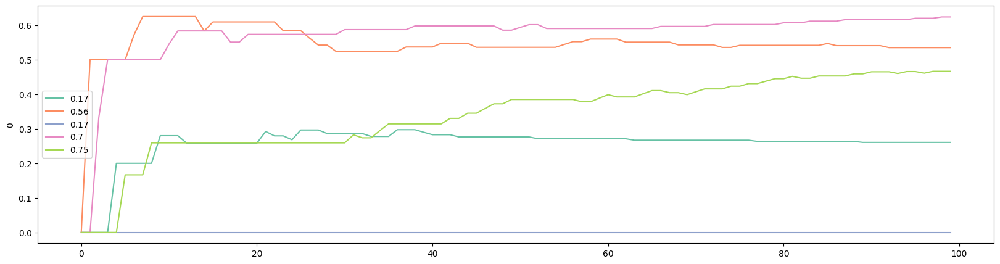
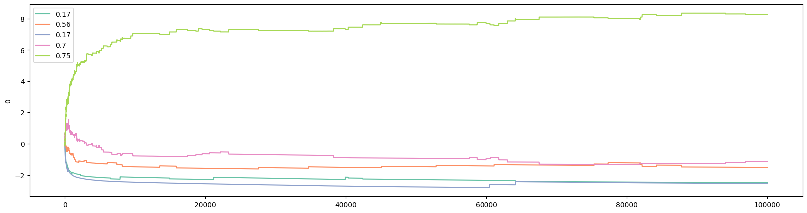

随机对照试验的贝叶斯方法（4）：Gradient Bandit Algorithm
===================================================

**作者：** *罗子俊*

我们在前面的文章里介绍了Epsilon Greedy，Optimistic Initial Values，以及Upper Confidence Bound这三个算法：

* 随机对照试验的贝叶斯方法（1）：Epsilon Greedy
* 随机对照试验的贝叶斯方法（2）：Optimistic Initial Values
* 随机对照试验的贝叶斯方法（3）：Upper Confidence Bound

今天，我们介绍“梯度（Gradient Bandit）”算法。与`UCB1`类似，这个算法并不完全依赖于预期收益。在Gradient Bandit算法中，每个老虎机被选中的概率由soft-max分布函数来决定：

$$\pi_n(i)=\frac{e^{H_n(i)}}{\sum_{j=1}^{J}{e^{H_n(j)}}}$$

其中 $\pi_n(i)$ 是 老虎机 $i$ 在第 $n$ 个访客时被选中的概率，$H_n(i)$ 衡量第 $n$ 个访客时系统对老虎机 $i$ 的偏好。当只有两个选择时，上面的设定与逻辑回归（logistic Regression）或Sigmoid函数是等价的。

在实验的最开始，我们通常把偏好函数 $H_1(j)$ 设置为0。这样的设定保证了在实验开始时每个老虎机被选中的概率是相等的。如果访客 $n(\geq1)$ 选定了老虎机 $i$，那么所有的偏好函数都会被更新。其中，老虎机 $i$ 的更新为

$$H_{n+1}(i)=H_n(i)+\alpha(x_n - \bar{x}_{n-1})(1-\pi_n(i))$$

而且其他的老虎机 $j\neq i$ 则更新为：

$$H_{n+1}(j)=H_n(j)-\alpha(x_n - \bar{x}_{n-1})\pi_n(j)$$

上述函数中的 $\alpha$ 决定了变化大小程度，与`UCB1`中的参数 $c$ 类似。

从直觉上来说，如果老虎机 $i$ 在被选择后其收益大于其预期收益，那么Gradient Bandit算法将会增加 $i$ 在下一访客时被选中的概率。因为我们的例子只有“买”和“不买” 两个可能性，所以只有在访客 $n$ 购买的情况下，老虎机 $i$ 的收益才会高于其预期收益。

接下来，让我们看看Gradient Bandit的伪代码：

```
H = [0] * number_of_bandits

loop:
  pi = pi(H) # Calculates the soft-max distribution
  i = random.choices(bandits, weights=pi)
  H.update()
```

其中 `H.update()` 是用来更新偏好的函数。Gradient Bandit在Python中的具体实现如下：

```python
  ####################
  # gradient_bandit update
  def gb_update(
      self,
      i,
      k,
      a,
  ):

    outcome = self.pull(i)
    for z in range(len(self.pref)):
      if z == i:
        self.pref[z] = self.pref[z] + a * (outcome - self.prob_win[z]) * (1- self.pi[z])
      else:
        self.pref[z] = self.pref[z] - a * (outcome - self.prob_win[z]) * self.pi[z]
    
    self.prob_win[i] = (self.prob_win[i] * k + outcome) / (k+1)

    return self.pref

  # gradient bandit algorithm
  def gradient_bandit(
      self,
      a = 0.2,
  ) -> list:

    self.history.append([self.pi.copy(),
                         self.pref.copy(),
                         self.prob_win.copy()])

    for k in range(1, N):
      self.pi = np.exp(self.pref) / sum(np.exp(self.pref))
      pick = random.choices(list(range(len(self.pref))), weights = self.pi)
      i = pick[0]
      self.pref = self.gb_update(i, k, a)

      self.count[i] += 1
      self.history.append([self.pi.copy(),
                           self.pref.copy(),
                           self.prob_win.copy()])
    
    return self.history
```

在这里，我们对上述代码作以下说明补充：
1. 为了执行Gradient Bandit，我们新写了一个名为`gb_update()`的函数用于每轮中更新偏好。这个函数就是伪代码当中的`H.update()`；
2. `gradient_bandit()`方法有一个参数，$a$，相当于前面说到的 $\alpha$。$a$ 的默认值为0.2。$a$ 的值越小，那么`gradient_bandit()`会进行越多的探索；
3. 我们在保存Gradient Bandit的结果时，`history`中的每一行是三个列表。在这里，我们保存了除预期胜率以外的两个值：偏好和soft-max函数所得到的概率 $\pi(i)$；
4. 在代码中，我们使用了`random`库中的`choices()`函数。这个函数会根据`weights`所指定的权重来作选中。这里的权重就是上述soft-max函数所得到的概率。

因为`gradient_bandit()`方法所保存的`history`结构变得不一样了，所以我们需要更新可视化所用到的函数`plot_history()`：

```python
def plot_history(
    history: list,
    prob_true: list,
    col = 2,
    k = N,
):

  if type(history[0][0]) == list: # to accommodate gradient bandit
    df_history = pd.DataFrame([arr[col] for arr in history][:k])
  else:
    df_history = pd.DataFrame(history[:k])

  plt.figure(figsize=(20,5))

  # Define the color palette
  colors = sns.color_palette("Set2", len(prob_true))

  for i in range(len(prob_true)):
    sns.lineplot(x=df_history.index, y=df_history[i], color=colors[i])
  
  # Create custom legend using prob_true and colors
  custom_legend = [plt.Line2D([], [], color=colors[i], label=prob_true[i]) for i in range(len(prob_true))]
  plt.legend(handles=custom_legend)
```

更新只出现在开头：

```python
  if type(history[0][0]) == list:
    df_history = pd.DataFrame([arr[col] for arr in history][:k])
  else:
    df_history = pd.DataFrame(history[:k])
```

在这里，我们首先判断`history`的第一个元素是否是列表，如果是列表，那么就意味着这是从`gradient_bandit()`中保存下来的，那么我们就需要选择我们需要列（`col`）来做可视化。

执行以下命令会跑Gradient bandit实验：

```python
# Gradient bandit
gb = BayesianAB(N_bandits)
print(f'The true win rates: {gb.prob_true}')
gb_history = gb.gradient_bandit()
print(f'The observed win rates: {gb.prob_win}')
print(f'Number of times each bandit was played: {gb.count}')

# plot the entire experiment history
plot_history(history=gb.history, prob_true=gb.prob_true)
```

以下是结果：

```
The true win rates: [0.17, 0.56, 0.17, 0.7, 0.75]
The observed win rates: [0.2564, 0.5514, 0.0105, 0.6636, 0.7498]
Number of times each bandit was played: [35, 67, 22, 196, 99679]
```


跟其他算法类似，我们也可以看看头100个访客的情况：



我们还可以通过下面的代码来画偏好函数的如何变化：

```python
# plot preference
plot_history(history=gb.history, prob_true=gb.prob_true, col=1)
```



我们还可以画soft-max函数的变化：

```python
# plot pi
plot_history(history=gb.history, prob_true=gb.prob_true, col=0)
```


前面说了，Gradient Bandit是我最喜欢的两个方法之一（另外一个是Optimistic Initial Values）。这其中，有三个重要原因：
1. 作为一个经济学家，我对使用“偏好”来对选择进行建模非常熟悉；
2. 经济学家也比较熟悉逻辑回归（logistic regression），而logistic regression中用到的Sigmoid函数正是soft-max分布的特例；
3. 我的其中一个研究领域是冲突理论。在冲突理论的文献中，soft-max函数被称作contest success function。

在下一篇文章，我们将介绍汤普森采样（Thompson Sampling）。其实汤普森采样这才是真正的贝叶斯方法。