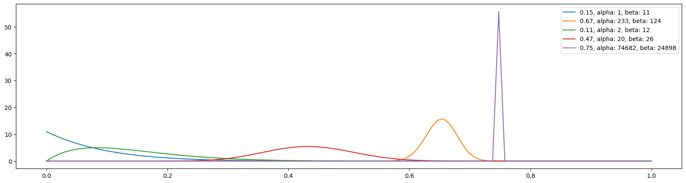

随机对照试验的贝叶斯方法（5）：Thompson Sampling
===================================================

**作者：** *罗子俊*

我们在前面的文章里介绍了4个算法：

* 随机对照试验的贝叶斯方法（1）：Epsilon Greedy
* 随机对照试验的贝叶斯方法（2）：Optimistic Initial Values
* 随机对照试验的贝叶斯方法（3）：Upper Confidence Bound
* 随机对照试验的贝叶斯方法（4）：Gradient Bandit Algorithm

今天，我们介绍一个真正的贝叶斯方法：汤普森采样（Thompson Sampling）。在我们讨论Upper Confidence Bound或者UCB1的时，我们说过，作选择时只看预期收益并不够准确。所以，UCB1在预期收益的基础上增加了一个“奖励”。这个奖励会随着一个老虎机被选择次数的增加而缩小。在上一篇文章里，我们讨论了Gradient Bandit算法。在其中，预期收益也不是决定选择的惟一因素。老虎机被选中的概率取决于“偏好”以及soft-max分布函数。

在汤普森采样当中，我们并不再根据任何单一的数值来作决策，而是通过采样的方法来构造每个老虎机的预期收益的分布。在贝叶斯统计的方法中，所有的变量都是随机函数，这也包括了函数的参数。一般来说，当我们讨论正态分布的时候，我们需要知道分布的均值和方差。可是在贝叶斯统计里，均值和方差都是随机函数，可以通过概率函数来刻画。

汤普森采样的数学推导中需要设计共轭先验（conjugate prior）。我们在这里先对共轭先验作一个简单的讨论。

## 共轭先验

我们首先从贝叶斯定理的公式开始讲：

$$p(\theta \mid X)=\frac{p(X \mid \theta)p(\theta)}{p(X)}$$

这个式子由四个部分组成：

* $p(\theta \mid X)$：后验分布
* $p(X \mid \theta)$：似然函数
* $p(\theta)$: 先验分布
* $p(X)$: 证据

在贝叶斯统计中，如果后验分布于先验分布可以由同一个分布函数来描述，那么这两个函数就被称作是“共轭”，而这个先验分布就是似然函数的共轭先验函数。

因为先验和后验函数是共轭，所以在使用贝叶斯方法时，在更新概率时就只需要更新函数的参数。如果你对这个问题的细节感兴趣，建议可以去找一本统计学教材看看。在我们的例子当中，因为我们只关心一个访客买或者不买，所以我们的似然函数的伯努利分布。而伯努利分布的共轭先验是Beta分布。Beta分布有两个参数：$\alpha$ 和 $\beta$ 。

在这样的前提下，在每一轮决策中，汤普森采样的实现只需要执行以下两个步骤：
* 对各个老虎机进行采样，其中每个老虎机都是一个Beta函数
* 找到采样中的最高预期值

## 汤普森采样：代码

首先，我们来看看伪代码：

```
loop:
    sampling from Beta function for bandit b
    j = argmax(b.sample() for b bandits)
    x = reward (1 or 0) from playing bandit j
    bandit[j].bb_update(x)
```

跟Gradient Bandit一样，我们需要为汤普森采样写一个专门的函数，`bb_update()`。以下是完整的Python代码：

```python
from scipy.stats import beta

    ####################
    # bayesian_bandits update
    def bb_update(
            self,
            a,
            b,
            i,
    ):

        outcome = self.pull(i)
        a[i] += outcome
        b[i] += 1 - outcome
        self.count[i] += 1

        return a, b

    # Bayesian bandits
    # For Bernoulli distribution, the conjugate prior is Beta distribution
    def bayesian_bandits(
            self,
            sample_size: int = 10,
    ):

        a_hist, b_hist = [], []
        a_hist.append(self.alpha.copy())
        b_hist.append(self.beta.copy())

        for k in range(1, self.N):
            sample_max = []

            for m in range(len(self.prob_true)):
                m_max = np.max(np.random.beta(self.alpha[m], self.beta[m], sample_size))
                sample_max.append(m_max.copy())

            i = np.argmax(sample_max)

            self.alpha, self.beta = self.bb_update(self.alpha, self.beta, i)
            a_hist.append(self.alpha.copy())
            b_hist.append(self.beta.copy())
            self.history_bandit.append(i)  # for Monte Carlo

        self.history = [a_hist, b_hist]
        return self.history
```

代码中有几点需要注意的：
1. 在`BayesianAB`类的最开始，我们就构造了`alpha`和`beta`两个变量；
2. 我们需要导入`scipy.stats`库中的`beta`来进行采样；
3. 函数`bb_update()`用来更新老虎机Beta函数的参数值。如果访客购买了产品，那么`alpha`就会加1。反之，`beta`则加1；
4. 在每一轮中，我们首先从采样中找到每个老虎机的最大值，然后再从这些最大值中找到最大值，然后进行选择；
5. 在汤普森采样中，我们不再储存预期收益的值，因为预期收益是由Beta函数来描述的，所以我们储存的是`alpha`和`beta`的值。

因为储存的内容不一样，所以我们还需要写一个专门的函数来做可视化：

```python
def bb_plot_history(
        history: list,
        prob_true: list,
        k=-1,
):
    x = np.linspace(0, 1, 100)
    legend_str = [[]] * len(prob_true)
    plt.figure(figsize=(20, 5))

    for i in range(len(prob_true)):
        a = history[0][k][i]
        b = history[1][k][i]
        y = beta.pdf(x, a, b)
        legend_str[i] = f'{prob_true[i]}, alpha: {a}, beta: {b}'
        plt.plot(x, y)

    plt.legend(legend_str)
```

执行以下代码，我们可以执行汤普森采样实验：

```python
bb = BayesianAB(N_bandits)
print(f'The true win rates: {bb.prob_true}')
bb_history = bb.bayesian_bandits(sample_size=10)
print(f'The observed win rates: {np.divide(bb.history[0][-1], bb.count)}')
print(f'Number of times each bandit was played: {bb.count}')

# plot the entire experiment history
bb_plot_history(history=bb.history, prob_true=bb.prob_true)
```

结果如下：

```
The true win rates: [0.15, 0.67, 0.11, 0.47, 0.75]
The observed win rates: [0.1, 0.6563, 0.1667, 0.4545, 0.7500]
Number of times each bandit was played: [10, 355, 12, 44, 99578]
```



我们可以看看100个访客后的情况:


我们在前面已经讨论过，汤普森采样并不会直接给出预期收益，而是通过Beta函数来给出预期收益的*分布*。从上面的结果我们也可以注意到，汤普森采样可以准确地区别胜率为0.67和0.75的两个老虎机。

下一篇文章将会是这一章的最后一篇。我们将会对这些算法进行比较和总结。