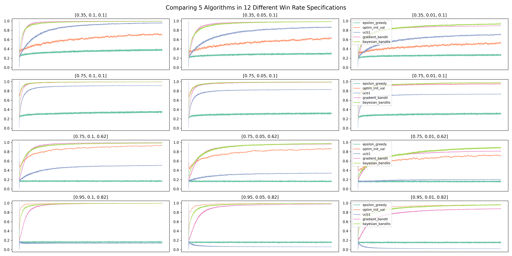

随机对照试验的贝叶斯方法（6）：总结
===================================================

**作者：** *罗子俊*

我们在前面的文章里介绍了5个算法：

* 随机对照试验的贝叶斯方法（1）：Epsilon Greedy
* 随机对照试验的贝叶斯方法（2）：Optimistic Initial Values
* 随机对照试验的贝叶斯方法（3）：Upper Confidence Bound
* 随机对照试验的贝叶斯方法（4）：Gradient Bandit Algorithm
* 随机对照试验的贝叶斯方法（5）：Thompson Sampling

这这篇文章里，我们对这几个算法作一个比较。比较的思路与Sutton and Barto（2020）中所提的类似：我们会将每个算法跑2000遍，然后计算在每一轮胜率最高的老虎机所被选择的概率。譬如，我们设定不一样的胜率来跑2000次Epsilon Greedy，然后发现在第100轮的时候，其中800次模拟都选择了胜率最高的老虎机，那么第100轮中Epsilon Greedy选中胜率最高的老虎机的概率就是40%。

为了进行这个模拟实验，我们需要将

```python
self.history_bandit.append(i)
```

加入到以下的函数中：
* `update()`
* `gradient_bandit()`
* `bayesian_bandits()`

并且在`BayesianAB`类的最开始也加入`self.history_bandit`。另外，我们还对`BayesianAB`进行修改，让它可以接受三个参数：`p_max`, `p_diff`, 和`p_min`。这三个参数分别代表代表
* 最优老虎机的胜率
* 最优老虎机与次优老虎机的胜率差异
* 最差的老虎机的胜率

模拟实验会用到`BayesianAB`，具体代码如下：

```python
import numpy as np
import pandas as pd
import matplotlib.pyplot as plt
import seaborn as sns
from multiprocessing import Pool, cpu_count
from functools import partial

from bayesianab import BayesianAB

# set the number of bandits
N_bandits = 5
# set the number of visitors
N = 10001
# set the number of trials
M = 2000


def worker(algo, number_of_bandits, number_of_trials, p_max, p_diff, p_min, n):
    bayesianab_instance = BayesianAB(number_of_bandits, number_of_trials, p_max, p_diff, p_min)
    getattr(bayesianab_instance, algo)()
    return bayesianab_instance.history_bandit


def monte_carlo(
        algos,
        m=500,
        n=10001,
        p_max: float = .75,
        p_diff: float = .05,
        p_min: float = .1
):
    algos_hist = {algo: [] for algo in algos}

    for algo in algos:
        print(f'Running {algo}...')
        with Pool(cpu_count()) as pool:
            func = partial(worker, algo, N_bandits, n, p_max, p_diff, p_min)
            results = list(pool.imap(func, range(m)))

        algos_hist[algo] = results

    return algos_hist


def run_monte_carlo(
        algos,
        m,
        n,
        p_values,
):
    trials = {}
    df_all = {}

    for i in range(len(p_values)):
        print(f'The p_values are {p_values[i]}')
        trials[f'p{i}'] = monte_carlo(algos,
                                      m,
                                      n,
                                      p_values[i][0],
                                      p_values[i][1],
                                      p_values[i][2],)

    for i in range(len(p_values)):
        df = pd.DataFrame()
        for j in algos:
            lst = [0] * (N - 1)
            for k in range(M):
                lst = np.array(lst) + np.array([1 if x == 4 else 0 for x in trials[f'p{i}'][j][k]])
            df[j] = (lst / M).tolist()

        df_all[f'p{i}'] = df.copy()

    return df_all


def plot_monte_carlo(
        df_all,
        algos,
        col,
        row,
):
    figure, axis = plt.subplots(row, col, figsize=(20, 10))
    colors = sns.color_palette("Set2", len(algos))

    m = 0  # column index
    n = 0  # row index

    for key in df_all:
        ax = axis[n, m]
        for i in range(len(algos)):
            sns.lineplot(x=df_all[key].index, y=df_all[key][algos[i]], linewidth=0.5, color=colors[i], ax=ax)

        ax.set_ylabel('')
        ax.set_title(prob_list[n * 3 + m])
        ax.set_xticks([])

        if m == 2:
            # Create custom legend using prob_true and colors
            custom_legend = [plt.Line2D([], [], color=colors[i], label=algos[i]) for i in range(len(algos))]
            ax.legend(handles=custom_legend, loc='upper left', fontsize=9)
            n += 1
            m = 0
        else:
            m += 1

    figure.suptitle('Comparing 5 Algorithms in 12 Different Win Rate Specifications', fontsize=16)

    # Adjust the spacing between subplots
    plt.tight_layout()

    plt.savefig("comparison.png", dpi=300)
    # plt.show()


if __name__ == "__main__":
    algorithms = ['epsilon_greedy', 'optim_init_val', 'ucb1', 'gradient_bandit', 'bayesian_bandits']
    prob_list = [[.35, .1, .1], [.35, .05, .1], [.35, .01, .1],
                 [.75, .1, .1], [.75, .05, .1], [.75, .01, .1],
                 [.75, .1, .62], [.75, .05, .62], [.75, .01, .62],
                 [.95, .1, .82], [.95, .05, .82], [.95, .01, .82],
                 ]

    results_df = run_monte_carlo(algorithms, M, N, prob_list)

    plot_monte_carlo(results_df, algorithms, 3, 4)
```

这里作一些简单的解释。第一，考虑到每个实验都要跑2000次，我这里用了`multiprocessing`库来做平行运算。代码中的`worker()`定义了平行运算中每一轮所执行的内容。代码中最重要的方法是`monte_carlo()`。它接受6个参数：
1. `algos` 是算法名称的列表。这些名称与`BayesianAB`当中的对应：
```python
algorithms = ['epsilon_greedy', 'optim_init_val', 'ucb1', 'gradient_bandit', 'bayesian_bandits']
```
2. `m` 是模拟的次数，默认值是500，但是我们将跑2000次;
3. `n` 是访客的数量。之前我们用的是10万个，在这里，只用1万;
4. `p_max`，`p_diff`，和`p_min`在前面已经提过了。

在模拟中，我们会考虑12组不同的`[p_max, p_diff, p_min]`组合：

```
    prob_list = [[.35, .1, .1], [.35, .05, .1], [.35, .01, .1],
                 [.75, .1, .1], [.75, .05, .1], [.75, .01, .1],
                 [.75, .1, .62], [.75, .05, .62], [.75, .01, .62],
                 [.95, .1, .82], [.95, .05, .82], [.95, .01, .82],
                 ]
```

代码中的`run_monte_carlo()`将执行`monte_carlo()`并将结果储存在一个名为`df_all`的字典中。

`plot_monte_carlo()`是作图的函数。每个图的题目就是`[p_max, p_diff, p_min]`的值。

2000轮模拟的结果如下：



图中展示了几个有意思的结果。
1. `Thompson Sampling`和`Gradient Bandit`这两个算法的结果都非常好。其中，`Thompson Sampling`在几乎所有的模拟实验结束的时候都有90%或以上的概率选中胜率最高的老虎机，而`Gradient Bandit`在`p_diff`的取值很小的时候，则表现差一些。`p_diff`取值小意味着最优和次优两个老虎机的胜率可能很接近；
2. `Epsilon Greedy`算法的表现始终如一：只有大概20%的概率选中胜率最高的老虎机。这可能跟epsilon设置为0.5过高有关系；
3. `UCB1`是这些算法当中对胜率分布最敏感的。当最优老虎机的胜率为0.95时，`UCB1`的表现非常奇怪。这可能因为算法中的$c$值的默认值是1。当最优老虎机的胜率很高时，`UCB1`能够给各个算法所给的奖励有限，这也导致了它无法成功区分不同的老虎机。值得提一下的是，在Sutton and Barto（2020）的书中，`UCB`的表现是最好的。

## 总结与拓展

在这篇文章里，我介绍了进行实时A/B测试和随机对照试验的5种算法。这些算法不仅不需要如传统方法那样提前计算最小样本量，它们还很容易被使用到多于两个版本或老虎机的情况。在文章里，我们一直用的例子有5个老虎机。

多臂老虎机其实是强化学习一个最简单的问题。在后面的文章里，我们还会回到强化学习这个题目上。

这里值得提一下的是多臂老虎机的两个拓展：非固定老虎机（Non-stationary Bandit）和上下文老虎机（Contextual Bandit）。非固定老虎机的意思是胜率会随着时间而改变。我们这里介绍的5个算法里，`Optimistic Initial Values`在非固定老虎机的情形下表现会特别糟糕，因为这个算法在最开始的时候进行探索，但是在确定了一个胜率高的老虎机之后，并没有很好的探索手段，从而导致它的选择不会随时间而显著改变。

上下文老虎机，就如它的名字所表达的，就是老虎机是有上下文或者是有“背景”的。譬如说，一个赌场里面绿色的老虎机胜率比红色的高。一开始的时候可能你不知道，但是后面发现了，你就会选择绿色的老虎机，这个时候，你所作的，就是有“背景”的选择。上下文老虎机也被称作Associative Search。我们在另外的文章里会再提到这个算法。

（如果你想得到最新的代码，请访问：https://github.com/DataHurdler/Econ-ML/tree/main/Multi-Arm%20Bandits）

## 参考资料

* https://www.udemy.com/course/bayesian-machine-learning-in-python-ab-testing/
* http://incompleteideas.net/book/the-book-2nd.html (Chapter 2)
* https://en.m.wikipedia.org/wiki/Multi-armed_bandit
* https://www.tensorflow.org/agents/tutorials/intro_bandit