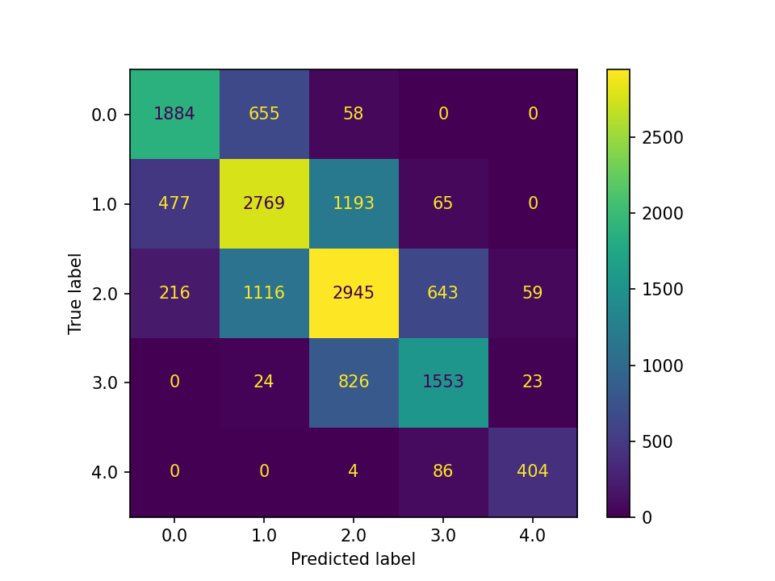
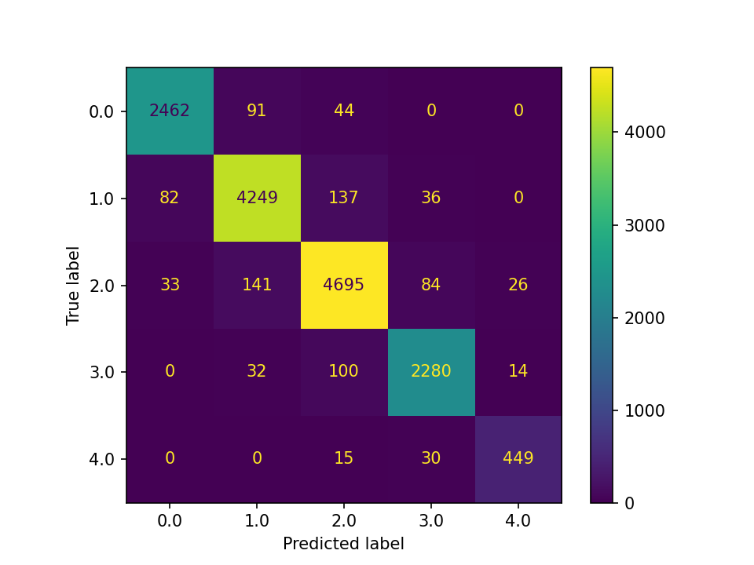
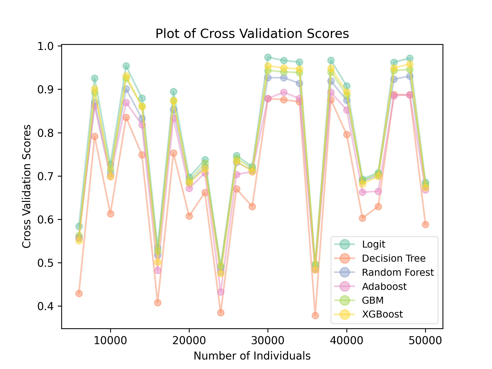
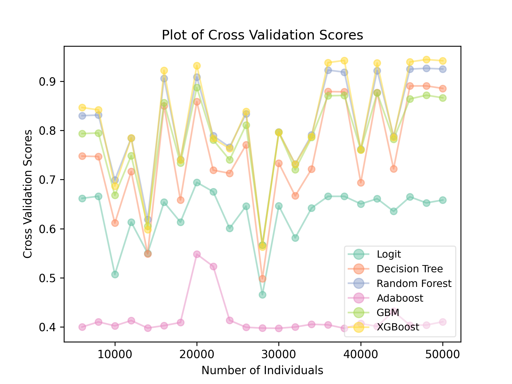

<!-- omit in toc -->
离散选择，分类，和基于树模型的集成算法
================================

**作者：** *罗子俊*

## 引言

如果你是一个很成功的电商，现在考虑在全国几个大城市开实体店。你的电商经验告诉你，不同地区对产品的需求是不一样的。你希望能够有办法通过数据来了解不同的市场，因为对市场的了解将会影响到你的货存决策。顾客对你产品的购买，是一个“离散选择”问题：他们决定“买”还是“不买”。这个决策跟考虑“我今天晚上要锻炼多长时间”是不一样的。

在经济学和社会科学里，比较流行的是“自上而下”（top-down）的方法：首先我们需要了解数据是怎么来的，然后我们有一些假设。Logit和Probit是两个常用的离散选择模型。如果干扰项是逻辑分布，那么我们就用logit或者说逻辑回归。如果干扰项是正态分布，那么就是probit。其他各种不同的情形，也大多有相应的模型。这些方法的好处是可以做假设检验，并且有助于对机制的了解。这些都是经济学和社会科学所关心的。

与社会科学不同，机器学习更关心预测，所以机器学习的算法一般是“自下而上（bottom-up）的。我们可以说，经济学的离散选择模型更注重偏差（bias），但是机器学习的方法在考虑偏差和方差（variance）时更全面。

## 偏差-方差间权衡（The Bias Variance Tradeoff）

我们先说*方差（Variance）*。一个模型如果方差比较高，那么就意味着它对训练数据集（training data）非常敏感，从而能够捕抓到训练数据当中的很多细节。可是，这样的模型是很难被一般化的。一方面，实际用于预测的数据未必跟训练数据集一样详尽。另外一方面，在训练数据集中重要的变量，在以后得数据里，未必重要。

一个可以捕抓到数据中细节的模型，通常都有低偏差（bias）。我们的算法要从训练数据集中学习，如果它的偏差比较高，那么它能够准确预测的可能性也很低。所以，虽然我们很难见到偏差和方差都低的模型，我们常常把降低偏差放在更重要的位置。一个降低方差的办法，就是通过修改模型的参数，使得训练数据集中更多的细节能被模型捕抓到。但是这么做，就更让方差变高。这也就是为什么这二者之间存在权衡的原因。

我们来考虑一个例子。假设一个动物园希望训练一个机器学习模型来区分不同的企鹅的品种。为了这个任务，动物园的工作人员和数据科学家给动物园里的企鹅拍了很多照片，把这些照片用来训练和测试模型。他们发现，算法判断企鹅种类的准确率高达98%。

可是，当动物园的游客在其他水族馆里使用这个算法时，发现它根本没有办法准确判断企鹅种类。为什么呢？原来这个算法并没有根据企鹅的一些特征，譬如他们的头，脖子，和尾巴，来判断企鹅的种类。动物园的算法是通过企鹅身上的标记来判断的。在这个动物园里，不同的企鹅，是用不同颜色来标记的。但是其他的水族馆，用的是其他的标记方式。所以，这个算法，虽然它在训练时偏差很低，但是它的方差却很高，因为它完全是基于这一个动物园对企鹅所作的标记来进行预测的。

下一篇文章，我们会讨论简单的决策树算法。我们会发现，决策树算法很容易出现高方差，或者说过度拟合（over-fitting）。

## 决策树

我们首先来讨论最基本的模型：决策树。因为我们在Python代码中会使用 [scikit-learn](https://scikit-learn.org/stable/)，所以我们的讨论会尽量保持与scikit-learn的使用说明一致。需要注意的是，这里对决策树的讨论只限于其中重要的或者与文章后面介绍的算法相关的内容。在网络上你可以找到很多对决策树更深入的介绍，譬如[An Introduction to Statistical Learning](https://www.statlearning.com/) 和 [The Elements of Statistical Learning](https://hastie.su.domains/ElemStatLearn/)这两本书中的相关内容。

理解决策树最简单的方法是把它想象成一个流程图，特别是用于作诊断或判断的流程图。我们把很多数据提供给电脑，然后电脑通过决策树算法来构造一个流程图来解释数据。回到前面的例子，如果我们有很多关于顾客的数据，那么我们就有可能通过决策树算法来构造一个决策树，来判断一个顾客是会蓝色还是黄色的产品：

* 顾客有30岁吗?
  * 有：顾客是女性吗?
    * 是：顾客是回头客吗?
      * 是：这个顾客有90%概率会买黄色
      * 不是：这个顾客有15%概率会买黄色
    * 不是：顾客已婚吗?
      * 已婚：这个顾客有5%概率会买黄色
      * 未婚：这个顾客有92%概率会买黄色
  * 没有：顾客有50岁吗?
    * 有：这个顾客有10%概率会买黄色
    * 没有：顾客是回头客吗？
      * 是：这个顾客有100%概率会买黄色
      * 不是：这个顾客有20%概率会买黄色

从这个例子当中，我们可以看到决策树算法的几个基本特征：
1. 决策树算法的结果可以很容易地被展示为树状图；
2. 树状图并不需要是对称的。譬如，当顾客我们知道顾客有50岁时，那一个分支就直接结束了，导致这个分支相对短一些；
3. 同一个变量可以被使用多次。在这个例子当中，“顾客是回头客吗?”出现了两次；
4. 数值变量和分类变量都能用。在这里例子当中，年龄是数值变量，其他的都是分类变量；
5. 通常，每个节点只拆分成两个分支。有一个分类变量有三个分类，那么可以先分成两组，然后下一个分支再分两组。

决策树算法中还有一些重要的方面是这个例子中无法展现的。以下两节内容，我们就来了解一下

## 拆分标准

决策树算法的每一次拆分，都需要根据一定的标准来进行。这些标准当中最常用的两个是基尼系数（Gini impurity）和信息熵（Entropy）。我们用

$$p_{mk}=\frac{1}{n_m}\sum_{y\in Q_m}{I(y=k)}$$

来代表类型 $k$ 在节点 $m$ 所占比重，其中 $Q_m$ 是节点 $m$ 的所有数据，$n_m$ 是在节点 $m$ 的样本数。如果 $y=k$，那么$ I(\cdot)$ 取值为1，否则取值为0。那么，基尼系数的计算如下：

$$H(Q_m)=\sum_{k}{p_{mk}(1-p_{mk})}$$

而信息熵的计算则是：

$$H(Q_m)=-\sum_{k}{p_{mk}\log{(p_{mk})}}$$

在每一个节点 $m$，一个“候选方法（candidate）”被定义为变量和阈值的组合。譬如说，“顾客有30岁吗”这个候选方法中，变量是年龄而阈值是30。如果我们 $\theta$ 来代表候选方法，而这个方法把 $Q_m$ 拆分为两组：$Q_m^{\text{left}}$ 和 $Q_m^{\text{right}}$，那么，这个拆分的质量（quality）可以通过标准函数（criterion function）的加权平均来计算：

$$G(Q_m, \theta) = \frac{n_m^{\text{left}}}{n_m}H(Q_m^{\text{left}}(\theta)) + \frac{n_m^{\text{right}}}{n_m}H(Q_m^{\text{right}}(\theta))$$

决策树算法的目标就是寻找在每一个节点可以最小化上述质量函数（quality function）的候选方法：

$$\theta^* = \argmin_{\theta}{G(Q_m, \theta)}$$

我们很容易发现，无论我们用的是基尼系数还是信息熵来作为标准函数，在没有限制条件下，$G(Q_m, \theta)$ 的最小值将在$p_{mk}=0$ 或 $p_{mk}=1$ 时实现。换句话说，当拆分后只有一个分类时，质量函数的值会最小。

值得一提的是，决策树算法中中存在一个全局最优（global optimum），但是找到这个全局最优所需的计算量太大了。在实践当中，决策树算法找的是最小化每个节点质量函数的局部最优（local optima）。

## 修剪

如果拆分后只有一个分类时能最小化质量函数 $G(Q_m, \theta)$，那为什么前面的例子中消费者购买黄色的概率不是0或者100%？这里的主要原因有两个。第一我们未必有足够的变量来得到完全的分类。打个比方，如果有两个消费者，他们各方面都一样但是其中染了蓝色的头发的会买蓝色。如果头发的颜色并不是你数据库中的一列，那么你就无法区分开这两个消费者，从而也没有办法把决策树拆分得“完美”。

第二个原因，则是我们前面讲到过的“偏差-方差间权衡”。找到一个拆分“完美”的决策树可能会导致方差很高。回到前面的例子，可能头发的颜色是你数据库中的一列，但是这个根据头发颜色来进行拆分，实际上只在上面所说倒的例子里才有意义。又或者，头发颜色这个变量在你进行预测的数据里并没有。这个时候，你的算法就不知道该怎么办了。

这就是为什么决策树需要被“修剪”的原因。在实践当中，修剪通常通过两个参数（hyperparameter）来实现：决策树所允许层数的最大值（`max_depth`）以及每次拆分所要求的最小样本量（`min_samples_split`）。在这里，我们不对这两个参数作更多技术性分析。在直觉上，我们很容易理解为什么这两个参数会限制决策树的生长。

通过以上讨论，我们发现，决策树的缺点是很明显的：它可能会有高偏差，也可能会有搞方差。其中高方差的问题，特别严重。这就是为什么需要学习装袋法（bagging）和提升法（boosting）的原因。在实践当中，单棵的决策树通常只会被用来作为算法的一个展示，而很少会被用在实际决策中。

## 装袋法与随机森林

`装袋法`（Bagging）是其中改善决策树的方法方法之一。装袋法是“自助聚合”（boostrap aggregation）的简称。“自助聚合”这个名字能够很好得诠释装袋法的思路：从训练数据集中随机选取子集来跑决策树模型，然后再进行某种形式的加总。装袋法的具体思路取决于子集的构造，以下是常见的几种：

1. 当使用有放回抽样（自助法）抽取随机子集时，该算法被称为“Bagging”（Breiman，1996）。
2. 当使用无放回抽样抽取随机子集时，该算法被称为“Pasting”（Breiman，1999）。
3. 当根据特征而不是个体抽取随机子集时，该算法被称为“Subspaces”（Ho，1998）。
4. 当根据特征和个体同时抽取随机子集时，该算法被称为“Random Patches”（Louppe和Geurts，2012）。
5. 当使用有放回抽样（自助法）且在每次划分时选择一个随机特征子集时，该算法被称为“Random Forest”（随机森林）（Breiman，2001）。

在scikit-learn但中，前面4个算法可以通过`BaggingClassifier`来实现，而`随机森林`则需要用到`RandomForestClassifier`。

在使用装袋法时，最后的加总常常通过投票来进行。譬如，你用随机森林算法构造了1000棵决策树来预测顾客是否会购买你的产品。当算法来到第一个分支时，它会找到在1000棵决策树中用得最多的候选方法。譬如，“顾客是否有30岁”被其中800棵决策树选中，那么在算法作预测是，第一个分支就会通过这个来决定，剩下的分支，也如此类推。

装袋法虽然可以减少偏差，但是它最重要的意义在于通过自助的方法来减少方差。譬如，在随机森林算法中，减少方差是通过一下两个途径来实现的：第一，在自助选择随机样本时，随机森林相当于构建了很多不同的情形。这样不仅仅有利于减少算法都某个情形（譬如全样本）的以来，而且这些构建出来的情形中，很有可能有接近“未来”所出现的真实数据。第二，随机森林算法还会考虑随机的变量，这进一步减少了算法依赖某些变量的可能性。这也能够提高算法对别变量缺失的容忍程度。

## 提升法与AdaBoost

与装袋法不一样，提升法（Boosting）对降低偏差的效果更显著。但是提升法也能够保证比较低的方差，因为说到底，它也跟装袋法一样会构建很多决策树。但是装袋法的决策树是互相平行的，而提升法的决策树则是序贯（sequential）的。

提升法的基本原理是通过逐步进行提高来优化结果。这个原理可以用于任何的算法上。以下是提升法用在决策树上的伪代码：

```
Step 1: Build a simple decision tree (weak learner)
Step 2: Loop until stopping rule has reached:
            Try to improve from model in the previous iteration
```

目前主要的树状提升算法有三个：`AdaBoost`，`Gradient Boosting`，以及`XGBoost`。

`AdaBoost`最早由Freund and Schapire（1995）提出。它的全称是“适应性提升（*Ada*tive *Boost*ing”。Adaboost通过改变观察值的权重来进行提升。换句话说，在算法运行当中，有一些观察值会比另外一些显得更重要。假设训练集包含 $N$ 个个体，那么在最开始的时候每个个体的权重都是一样的：$1/N$。首先算法会跑一个简单的决策树模型，并且根据这个模型进行预测。然后算法会把那些它没有预测准确的观察值的权重增加，因为模型没有成功解释这些个体的行为。这个过程会一直持续，直到算法触发了某个停止规则（stopping rule）。譬如，“如果98%的个体都被解释准确了则停止”。

下面我们来看看AdaBoost的简单数学推导。

让 $w_{ij}$ 代表个体 $i$ 在低 $j$ 阶段的权重。在算法最开始的时候，所有 $i$ 的权重都是 $w_{i1}=1/N$。在第 $j$ 轮的决策树跑完之后，我们可以计算出错率：

$$e_j = \frac{\sum_{N}{w_{ij}\times I_{ij}(\text{incorrect})}}{\sum_{N}{w_{ij}}}$$

如果预测准确，那么 $I_{ij}(\text{incorrect})$ 取值为1，否则为0。接下来我们计算阶段 $j$ 的*阶段值*（*stage value*）：

$$v_j = \frac{1}{2}\log\left(\frac{1-e_j}{e_j}\right)$$

这个阶段值不仅会在更新 $w_{ij+1}$ 的时候会用到，它也会被用作预测模型 $j$ 时的权重。通过以下式子，我们可以更新权重：

$$w_{ij+1} = w_{ij} \times \exp{(v_j \times I_{ij}(\hat{y}_{ij}=y_i))}$$

其中 $\hat{y}_{ij}$ 是个体 $i$ 在阶段 $j$ 的预测，$y_i$ 是个体 $i$ 的真实值。在二元分类分体当中，$\hat{y}_{ij}$ 和 $y_i$ 常常取值为1或者-1，这样我们可以将上面权重的式子简化成：

$$w_{ij+1} = w_{ij} \times \exp{(v_j \times \hat{y}_{ij}\times y_i)}$$

从第二阶段开始，AdaBoost的目标是最小化 $e_j$。

最后，我们需要计算模型加权的过的预测值。让 $\hat{y}_{ij}$ 代表个体 $i$ 在阶段 $j$ 的预测值，那么总的预测值则为

$$\hat{y}_{i} = \sum_{J}{\hat{y}_{ij} \times v_j}$$

其中 $J$ 算法所用阶段的总数。

## Gradient Boosting and XGBoost

`Gradient Boosting` (Friedman, 2001) is another approach to boost. Instead of updating the weight after each stage/model, Gradient Boosting aims to minimize a loss function, using method such as gradient decent. The default loss function in scikit-learn, which is also the most common in practice, is the binomial deviance:

$$L_j = -2\sum_{N}{y_i\log{(\hat{p}_{ij})} + (1-y_i)\log{(1-\hat{p}_{ij})}}$$

where $N$ is the number of individuals, $y_i$ is the true label for individual $i$, and $\hat{p}_{ij}$ is the predicted probability that individual $i$ at stage $j$ having a label of $y$, and is given by the softmax (logistic) function when log-loss is specified:

$$\hat{p}_{ij} = \frac{\exp{(F_j(x_i))}}{1+\exp{(F_j(x_i))}}$$

where $F_j(x_i)$ is a numerical predicted value for individual $i$ by regressor $F_j(x)$. Here, $F_j(x)$ is the aggregated regressor in stage $j$, which is given by

$$F_j(x) = F_{j-1}(x) + h_j(x)$$

where $h_j(x)$ is the weak learner/regressor at stage $j$ that minimizes $L_j$. Substituting $F_M(x)$, the final regressor, into the above formula for $\hat{p}_{ij}$ gives the overall prediction of the Gradient Boosting model.

Finally, using first-order Taylor approximation, it can be shown that minimizing $L_j$ is approximately equivalent to predicting the negative gradient of the samples, where the negative gradient for individual $i$ is given by

$$-g_i = -\left[\frac{\partial l_{ij-1}}{\partial F_{j-1}(x_i)}\right]$$

where $l_{ij-1}$ is the term inside the summation in $L_j$ (but lagged one stage):

$$l_{ij-1} = y_i\log{(\hat{p}_{ij-1})} + (1-y_i)\log{(1-\hat{p}_{ij-1})}$$

In other words, while the basic decision tree algorithm aims to predict the true classes, usually represented by 0's and 1's, `Gradient Boosting` aims to predict a numerical value which is the gradient. This means that, at each stage, Gradient Boosting is a regression problem rather than a classification problem. Predicting the gradient allows the algorithm to utilize many well developed methods for such task, for example, the Nelder-Mead method or simple grid search.

The discussion above focused on binary classification, which requires a single tree to be built in each stage. In multiclass classification, $K$ trees would be built for $K$ classes. For example, if `Gradient Boosting` is used to identify the 26 English alphabets, 26 trees are built and fitted in each stage.

`XGBoost` was introduced by Tianqi Chen in 2014. It is short for "e*X*treme *G*radient *Boost*ing". Instead of gradient decent, `XGBoost` implements [Newton's Method](https://en.wikipedia.org/wiki/Newton%27s_method), which is computationally much more demanding than gradient decent and requires a second-order Taylor approximation (instead of first-order as in `Gradient Boosting`). Due to this, in addition to **Gradients**, `XGBoost` also calculates the **Hessians**, which are a set of second-order derivatives (whereas gradients are the first-order derivatives).

`Python` library `xgboost` implements `XGBoost` and can easily be integrated with `scikit-learn`, which is the library we use to implement all algorithms covered in this chapter.

## Python Implementation with scikit-learn

As we have done in other chapters, we will first generate a data set, then fit the data with various algorithms. After we have fitted the models, we will print out some basic performance metrics, chief among which is the `confusion matrix` and conduct a cross validation exercise.

The algorithms we will consider include:
* Logistic regression
* Decision tree classifier
* Random forest classifier
* Adaboost classifier
* Gradient boosting classifier
* XGBoost

Even though logistic regression is not covered in this chapter, I included it in the Python implementation for comparison purposes. Although not necessary, I use a Python class in this implementation. Here is the full script:

```python
import random
import string
import numpy as np
import pandas as pd
import matplotlib.pyplot as plt
from sklearn.cluster import KMeans
from sklearn.model_selection import train_test_split, cross_val_score
from sklearn.linear_model import LogisticRegression
from sklearn.tree import DecisionTreeClassifier
from sklearn.ensemble import RandomForestClassifier
from sklearn.ensemble import AdaBoostClassifier
from sklearn.ensemble import GradientBoostingClassifier
from sklearn.metrics import accuracy_score, precision_score, recall_score, f1_score
from sklearn.metrics import confusion_matrix, ConfusionMatrixDisplay
import xgboost

N_GROUP = 5
N_IND = 50000
N_FEATURES = 10


class TreeModels:
    def __init__(
            self,
            n_group: int = 5,
            n_individuals: int = 10000,
            n_num_features: int = 10,
            numeric_only: bool = False,
    ):
        """
        Initialize the TreeModels class.

        Args:
            n_group (int): Number of groups. Default is 5.
            n_individuals (int): Number of individuals. Default is 10000.
            n_num_features (int): Number of numerical features. Default is 10.
            numeric_only (bool): Flag to indicate whether to use only numerical features. Default is False.

        Returns:
            None
        """
        print(f'There are {n_individuals} individuals.')
        print(f'There are {n_group} choices.')
        print(f'There are {n_num_features} numerical features and 1 categorical feature.')

        self.numeric_only = numeric_only

        # Generate random numerical features and categorical feature
        self.num_features = np.random.rand(n_individuals, n_num_features + 2)
        cat_list = random.choices(string.ascii_uppercase, k=6)
        self.cat_features = np.random.choice(cat_list, size=(n_individuals, 1))

        # Create a DataFrame with numerical features and one-hot encoded categorical feature
        self.df = pd.DataFrame(self.num_features[:, :-2])
        self.df['cat_features'] = self.cat_features
        self.df = pd.get_dummies(self.df, prefix=['cat'])
        self.df.columns = self.df.columns.astype(str)

        if numeric_only:
            # Cluster the data based on numerical features only
            # Logistic regression performs the best in this condition
            kmeans = KMeans(n_clusters=n_group, n_init="auto").fit(self.num_features)
            self.df['target'] = kmeans.labels_
        else:
            # Cluster the data based on both numerical and categorical features
            cat_columns = self.df.filter(like='cat')
            kmeans1 = KMeans(n_clusters=n_group, n_init="auto").fit(cat_columns)
            kmeans2 = KMeans(n_clusters=n_group, n_init="auto").fit(self.num_features)
            self.df['target'] = np.floor((kmeans1.labels_ + kmeans2.labels_) / 2)

        # Add some random noise to the numerical features
        numerical_columns = [str(i) for i in range(n_num_features)]
        for column in numerical_columns:
            self.df[column] = self.df[column] + random.gauss(mu=0, sigma=3)

        # Split the data into training and testing sets
        self.X = self.df.drop(columns=['target'])
        self.y = self.df['target']
        self.X_train, self.X_test, self.y_train, self.y_test = train_test_split(
            self.X, self.y, test_size=0.3, random_state=42)

        # Initialize the y_pred variable
        self.y_pred = np.empty([n_individuals, 1])

        # Initialize a dictionary to save results
        self.results = dict()

    def show_results(self, clf, clf_name, print_flag=False, plot_flag=True):
        """
        Train and evaluate a classifier.

        Args:
            clf: Classifier object.
            clf_name (str): Name of the classifier.
            print_flag (bool): Whether to print results. Default is False.
            plot_flag (bool): Whether to draw CM plots and save them. Default is True.

        Returns:
            None
        """
        print(clf_name)
        clf.fit(self.X_train, self.y_train)
        self.y_pred = clf.predict(self.X_test)

        # Calculate evaluation metrics
        train_acc = clf.score(self.X_train, self.y_train)
        acc = accuracy_score(self.y_test, self.y_pred)
        precision = precision_score(self.y_test, self.y_pred, average='weighted')
        recall = recall_score(self.y_test, self.y_pred, average='weighted')
        f1 = f1_score(self.y_test, self.y_pred, average='weighted')

        # Perform cross-validation and print the average score
        cv_score = cross_val_score(clf, self.X, self.y, cv=10)

        if print_flag:
            if isinstance(clf, LogisticRegression):
                print(f'Coefficients: {clf.coef_}')
            else:
                print(f'Feature Importance: {clf.feature_importances_}')
            print(f'Training accuracy: {train_acc:.4f}')
            print(f'Test accuracy: {acc:.4f}')
            print(f'Test precision: {precision:.4f}')
            print(f'Test recall: {recall:.4f}')
            print(f'Test F1 score: {f1:.4f}')
            print(f'Average Cross Validation: {np.mean(cv_score)}')

        if plot_flag:
            # Plot the confusion matrix
            cm = confusion_matrix(self.y_test, self.y_pred, labels=clf.classes_)
            disp = ConfusionMatrixDisplay(confusion_matrix=cm, display_labels=clf.classes_)
            disp.plot()

            plt.savefig(f"cm_{clf_name}_{self.numeric_only}.png", dpi=150)

        plt.show()

        # Save results in self.result dictionary
        self.results[clf_name] = {
            'train_acc': train_acc,
            'acc': acc,
            'precision': precision,
            'recall': recall,
            'f1_score': f1,
            'cv_score': np.mean(cv_score)
        }


def run_tree_ensembles(
        n_group: int = 5,
        n_num_features: int = 10,
        print_flag: bool = True,
        plot_flag: bool = True,
        numeric_only_bool: list = (False, True),
        n_individuals: int = 50000,
) -> dict:

    for i in numeric_only_bool:
        tree = TreeModels(n_group, n_individuals, n_num_features, numeric_only=i)

        logit = LogisticRegression(max_iter=10000)
        tree.show_results(logit, 'logit', print_flag, plot_flag)

        d_tree = DecisionTreeClassifier()
        tree.show_results(d_tree, 'decisiontree', print_flag, plot_flag)

        rf = RandomForestClassifier()
        tree.show_results(rf, 'randomforest', print_flag, plot_flag)

        ada = AdaBoostClassifier()
        tree.show_results(ada, 'adaboost', print_flag, plot_flag)

        gbm = GradientBoostingClassifier()
        tree.show_results(gbm, 'gbm', print_flag, plot_flag)

        xgb = xgboost.XGBClassifier()
        tree.show_results(xgb, 'xgboost', print_flag, plot_flag)

        return {n_individuals: tree.results}
```

Here are some remarks about the script. First, the number of numerical features in the generated data set is given by `n_num_features`. Two additional columns of numerical features and six columns of string/categorical features are also included to add randomness and complexity to the generated data. The numerical features are stored in the `numpy` array `num_features` while the categorical features are stored in `cat_features`. These features are then properly processed and stored in the `pandas` dataframe `df`:

* Only the original numerical feature columns are stored (`self.num_features[:, :-2]`);
* The categorical features are one-hot encoded with `pd.get_dummies()`.

In the `if` statement that followed, the `Kmeans` algorithm is called to generate `n_group` classes/clusters.

Additional randomness is added to the numerical features by:

```python
        # Add some random noise to the numerical features
        numerical_columns = [str(i) for i in range(n_num_features)]
        for column in numerical_columns:
            self.df[column] = self.df[column] + random.gauss(mu=0, sigma=3)
```

The rest of the `TreeModels` class performs the train-test split and adds a method named `show_results()` to run the selected algorithm then print out (based on the value of `print_flag`) several performance metrics.

## Confusion Matrix and other Performance Metrics

`Confusion matrix` is the most important and common way to examine the performance of a classification algorithm. It is a matrix showing the numbers of individuals in each true-predicted label combination. In our simulated data, there are 5 classes, which results in a 5-by-5 confusion matrix. Below is the confusion matrix of the test data from the logistic regression. The simulation has included categorical features in generating the target groups:



In the confusion matrix, the rows show the "True label" whereas the columns show the "Predicted label". All the cells on the diagonal are corrected predicted. Based on the confusion matrix, there are three basic performance metrics: **accuracy**, **precision**, and **recall**. There are also various metrics that are weighted averages. For example, the **f1 score** is the harmonic mean of precision and recall.

Accuracy is the proportion of individuals that the algorithm has predicted correctly. To calculate the accuracy score, we sum up the values on the diagonal then decide the total:

$$\frac{1884+2769+2945+1553+404}{15000}=0.6370$$

Precision and recall are usually defined based on a certain class. For overall precision and recall scores, we can then take a weighted average. Precision is the proportion of individuals who the algorithm predicted to be a certain class is actually that class. In the above example, 2577 individuals were predicted to be class 0, but only 1884 actually are. As a result, the precision *for class 0* is:

$$\frac{1884}{2577}=0.7311$$

On the other hand, recall is the proportion of individuals who belong to a certain class that the algorithm predicted correctly. IN the above example, 4979 individuals belong to class 2, but only 2945 were predicted correctly by the algorithm. As a result, the recall *for class 2* is:

$$\frac{2945}{4979}=0.5915$$

If we take weighted average of precision and recall of all 5 classes, we get the overall precision and recall scores as 0.6376 and 0.6370, or about 63.7%.

Economics and social sciences often use the terms "Type I" and "Type II" errors, which can be related to the discussion here in a binary classification. In a binary classification, we have 4 quadrants:
1. True positive (TP): those who belong to the "positive" class and are predicted so;
2. True negative (TN): those who belong to the "negative" class and are predicted so. True positive and true negative are on the diagonal;
3. False positive (FP): those who are predicted to be "positive" but are actually "negative';
4. False negative (FN): those who are predicted to be "negative" but are actually "positive".

Type I error corresponds to false positive and Type II error corresponds to false negative.

Before we move on to formally compare results from the 6 algorithms, it is worth noting that random forest, gradient boosting, and XGBoost performed much better than logistic regression in the above simulated data set (with `random seed = 123`). For example, below is the confusion matrix from XGBoost:



## Comparison the Algorithms

The following `Python` script runs the comparison between different algorithms for between 6000 and 50000 individuals (sample size):

```python
import matplotlib.pyplot as plt
import random
import pandas as pd
from multiprocessing import Pool, cpu_count
from functools import partial
from tree_ensembles import run_tree_ensembles

plt.ion()

n_individuals_range = range(50000, 5999, -2000)


def run_monte_carlo(n_individuals_range, numeric_only_bool):

    with Pool(1) as pool:
        func = partial(run_tree_ensembles, 5, 10, False, False, numeric_only_bool)
        results = list(pool.imap(func, n_individuals_range))

    return results


def plot_monte_carlo(data: list):

    df_list = []
    for item in data:
        for i, inner_dict in item.items():
            for j, inner_inner_dict in inner_dict.items():
                value = inner_inner_dict['cv_score']
                df_list.append({'i': i, 'Model': j, 'cv_score': value})

    df = pd.DataFrame(df_list)

    fig, ax = plt.subplots()

    num_models = len(df['Model'].unique())
    cmap = plt.get_cmap('Set2')  # Use the Set2 color map

    for i, model in enumerate(df['Model'].unique()):
        model_data = df[df['Model'] == model]
        color = cmap(i % num_models)  # Cycle through the color map
        ax.plot(model_data['i'], model_data['cv_score'], '-o', c=color, label=model, alpha=0.5)

    ax.set_xlabel('Number of Individuals')
    ax.set_ylabel('Cross Validation Scores')
    ax.set_title('Plot of Cross Validation Scores')
    ax.legend(['Logit', 'Decision Tree', 'Random Forest', 'Adaboost', 'GBM', 'XGBoost'],
              loc='lower right',
              fontsize=9, markerscale=1.5, scatterpoints=1,
              fancybox=True, framealpha=0.5)
```

The script intends to use parallel computing, but algorithms in `scikit-learn` already utilized parallel computing, we set `Pool(1)` at the end to run it with single thread. Two comparisons, with and without using the categorical features in generating the target groups, are run. The average score from 10-fold cross validations are recorded and plotted. Here is the result from when `kmeans` generated the target groups without using the categorical columns (but they are still in the training data):



A single decision tree performed the worst, while, surprisingly, logistic regression performed the best. Keep in mind that the ups and downs at different sample sizes do not indicate that more data is worse. There is some random components in how the data was generated, namely with `kmeans` algorithm.

When categorical columns are included in generating the target groups, there exists more variations among algorithms:



In here, `Adaboost` performed noticeably worse than all other algorithms. Logistic regression also fell, partly because its inability to deal with categorical features (even with one-hot encoding). Not surprisingly, the performances of `Random Forest`, `Gradient Boosting`, and `XGBoost` remain strong.

## Summary

In this chapter, we have covered the decision tree algorithm as well as bagging and boosting algorithms based on decision tree. There are few important takeaways and remarks.

First, ensemble methods is a general method that applies to algorithms beyond tree-based models. You could easily applied the same principle of bagging and boosting on regression models. For example, you can build several regressors with a bootstrap data set, or include only some of the features, or use weighted methods to boost. As a matter of fact, ensemble can also be built between regression and classification algorithms. Gradient Boosting and XGBoost can actually be considered as such ensemble: while the end-goal of the algorithms were to predict classes, at their core, they are regressions.

Second, tree-based models can be used for regression problems. For example, instead of `RandomForestClassifier`, you can use `RandomForestRegressor` for a regression problem. When you are using a classification algorithm on a continuous target. Instead of trying to predict classes, the `RandomForestRegressor`, as well as other classification used for regression problems, aims to predict the mean of the target. We will cover this in more depth in a later chapter.

Third, in general, it is more accurate to predict classes than continuous values. Due to this, the use of classification algorithms may be broader than most expected. For example, it is possible to convert a regression problem (in predicting continuous quantities) to classification problems. The market share example given in the beginning of the chapter is a good example. Another example is e-commerce. Most e-commerce owners have a limited offering. As a result, instead of predicting the sales per month or the dollar value of a customer, it is easier to predict whether and how many a customer would buy. This method can be especially powerful since a business owner often has control over the price of the products.

Lastly, tree-based methods can be used for causal inference. While causal inference itself is a topic of a later chapter, for readers who are familiar with causal inference methods, you can easily find parallel between decision tree and propensity score matching (PSM): individuals who ended up in the same leave have something in common, and hence can provide good matching samples. This is the basic idea behind `causal tree` (Athey and Imbens, 2016).

## References

* S. Athey and G. Imbens, "Recursive partitioning for heterogeneous causal effects", *PNAS*, 2016.
* L. Breiman, "Bagging predictors", *Machine Learning*, 1996.
* L. Breiman, "Pasting small votes for classification in large databases and on-line", *Machine Learning*, 1999.
* L. Breiman, "Random forest", *Machine Learning*, 2001.
* Y. Freund and R. Schapire, "A Decision-Theoretic Generalization of on-Line Learning and an Application to Boosting", 1995.
* J. Friedman, "Greedy Function Approximation: A Gradient Boosting Machine", *The Annals of Statistics*, 2001.
* T. Ho, "The random subspace method for constructing decision forests", *Pattern Analysis and Machine Intelligence*, 1998.
* G. Louppe and P. Geurts, "Ensembles on Random Patches", *Machine Learning and Knowledge Discovery in Databases*, 2012.
* https://scikit-learn.org/stable/modules/tree.html
* https://xgboost.readthedocs.io/en/stable/tutorials/model.html
* https://machinelearningmastery.com/boosting-and-adaboost-for-machine-learning/
* https://stats.stackexchange.com/questions/157870/scikit-binomial-deviance-loss-function
* https://www.ccs.neu.edu/home/vip/teach/MLcourse/4_boosting/slides/